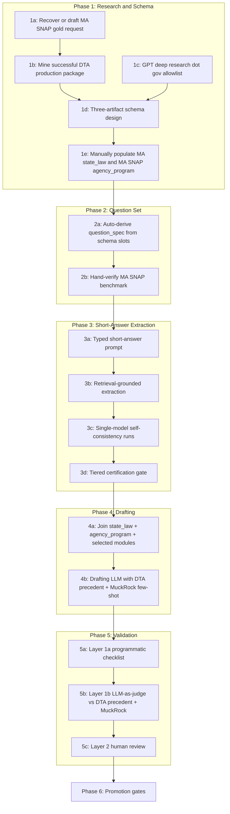

# Workflow Design V2 — Benefits Decoded Public Records Pipeline

> **Status:** supersedes `[workflow_design_V1.md](workflow_design_V1.md)`. V1 is preserved alongside this document as a design history.
>
> **Precedence:** when this document conflicts with the proposal at `docs/Benefits_Decoded_Project_Proposal.pdf`, this document wins (per RA decision). The proposal sets the long-term scientific aims; V2 sets the engineering plan to reach them.
>
> **Pilot scope (this document):** **Massachusetts × SNAP only**, end-to-end through every phase. All examples, prompts, schemas, and validation gates target this single state-program cell. Multi-state and multi-program work is treated as a *promotion target* (see §9), not as V2 scope.

---

## 0. TL;DR

We are building a reproducible LLM-assisted pipeline that turns official state government webpages and successful public-records productions into validated, structured "Request Playbook" data, and turns that data into state-compliant public records request letters. V2 is a redesign of [V1](workflow_design_V1.md) with six principal changes:

1. **Vertical-slice pilot.** We instrument the entire pipeline on one cell — Massachusetts × SNAP — before we add a second state or a second program. Breadth comes only after the architecture is proven on depth.
2. **Three-artifact decomposition.** The single playbook schema in V1 is split into `state_law` (50 rows long-term), `agency_program` (~300 rows long-term), and `request_modules` (jurisdiction-independent content blocks). Cardinality, update cadence, and authorship differ across the three; mixing them creates duplication and drift risk.
3. **Gold request + successful production before schema lock.** We recover or reconstruct a complete, submittable MA SNAP request letter *first*, and we mine the PI-provided successful DTA production package (`gold_letter.pdf`) before locking schemas or modules. This catches schema gaps and teaches the pipeline what actually produced useful records.
4. **Production-grounded request modules.** The request body is seeded from DTA's successful request language and the responsive Thomson Reuters / West Publishing CLEAR / ID Risk Analytics records, not only from generic FOIA examples.
5. **Short-answer typed extraction in Phase 3.** The current free-form "research and answer" prompt is replaced by a per-question-type prompt that constrains the LLM to a single typed value with explicit length and format limits (e.g., phone is exactly 10 digits, statute citation is one line ≤ 60 chars). This makes scoring near-deterministic and dramatically reduces matcher complexity in `[exp_results/score_experiments.py](../exp_results/score_experiments.py)`.
6. **Two-layer programmatic-then-semantic validation.** Phase 5 runs a deterministic checklist (Layer 1a) before any LLM-as-judge cost is paid (Layer 1b), and only escalates to human review (Layer 2) for drafts that survive both.

The doc is organized as **plan → reasoning → deliverables** in every phase so it functions as a design rationale, not a checklist.

---

## 1. What changes from V1 — auditable delta


| Topic                   | V1                                                                                                      | V2                                                                                                                                                                                                                                                                                        | Why we changed it                                                                                                                                                                        |
| ----------------------- | ------------------------------------------------------------------------------------------------------- | ----------------------------------------------------------------------------------------------------------------------------------------------------------------------------------------------------------------------------------------------------------------------------------------- | ---------------------------------------------------------------------------------------------------------------------------------------------------------------------------------------- |
| Pilot scope             | 5 states × pilot programs (proposal-aligned)                                                            | **MA × SNAP single cell** end-to-end                                                                                                                                                                                                                                                      | Breadth-first means failures are confounded across states/programs; depth-first isolates the architectural failure mode.                                                                 |
| Playbook schema         | One schema per `(state, program, agency)` row, ~300 rows                                                | **Three artifacts**: `state_law` (50), `agency_program` (300), `request_modules` (~8)                                                                                                                                                                                                     | State-law facts duplicate 6× across programs in V1. Splitting eliminates drift and parallelizes research.                                                                                |
| Schema design timing    | Schema first, then research populates it                                                                | **Gold request + successful production first, schema decomposed from both**                                                                                                                                                                                                               | Catches missing slots cheaply; gives end-to-end ground truth for Phase 5; uses empirical evidence about what DTA actually produced.                                                      |
| Production precedent    | Not represented                                                                                         | **PI-provided DTA production package mined in Phase 1**                                                                                                                                                                                                                                   | The successful MA DTA response includes Thomson Reuters / West Publishing CLEAR / ID Risk Analytics records, giving production-grounded request modules and benefits-tech system fields. |
| Phase 3 prompt          | Free-form "research and answer" with self-reported source                                               | **Typed short-answer extraction** with length, format, and grounding constraints                                                                                                                                                                                                          | Tight outputs collapse matcher complexity and reduce hallucination surface.                                                                                                              |
| Source grounding        | Self-reported source URL in the answer JSON                                                             | **Retrieval-grounded for web facts; production-document provenance for manually mined facts**                                                                                                                                                                                             | Bounds the LLM to retrieved web evidence while allowing local PDFs and public-records productions to support facts that are not on agency webpages.                                      |
| Certification criterion | Implicit: V1 §"Opt2" suggested ≥0.6 self-consistency on best model; proposal A1.3 says "100% agreement" | **Tiered: auto-certify / soft-certify / manual-queue**, combining single-model self-consistency + allowed-domain source. Multi-model cross-checking deferred to future work (see §7.3).                                                                                                  | The README Tier 1 result (Opus 76%, Gemma 44%, GPT-OSS 36%) showed cross-model agreement is dominated by the single strongest model. V2 collapses Phase 3 to Claude Opus 4.7 alone, keeps self-consistency and source-domain as the two orthogonal signals, and reroutes the multi-model cost into other parts of the pipeline. |
| Validation              | "MuckRock LLM-as-judge" + human review                                                                  | **Layer 1a programmatic checklist → Layer 1b DTA-precedent + MuckRock judge → Layer 2 human review**                                                                                                                                                                                      | Most missing-slot defects are deterministic; we shouldn't pay LLM cost for them.                                                                                                         |
| Question set            | Hand-curated list of example questions                                                                  | **Auto-derived from schema slots**, one question per field with type-specific scoring                                                                                                                                                                                                     | Keeps questions in lockstep with schema; refactor-safe.                                                                                                                                  |
| Schema fields           | 10 top-level keys                                                                                       | **Adds**: fee-waiver citation, expedited-processing citation, record definition, certification language, segregation clause, residency restriction, portal schema, state-specific quirks, `benefits_tech_systems[]`, mixed evidence provenance, plus reserved operational/tracking fields | Real FOIA letters need legal facts; benefits-tech requests also need structured vendor/system facts. Reserved fields prevent schema migration pain when we add the campaign tracker.     |
| Promotion logic         | "Pilot then scale" (1-step)                                                                             | **Four explicit gates** (v1 → v2 → v3 → scale) with quantitative pass criteria                                                                                                                                                                                                            | Each gate adds one axis of variation, so failures are diagnosable to the dimension that changed.                                                                                         |
| Repo hygiene            | `pipline/` (typo), `drafting_prompt.text`, empty placeholders                                           | `**pipeline/` rename completed**; normalized prompt filenames and canonical playbook artifacts remain pending                                                                                                                                                                             | Quality-of-life; path cleanup is now done before the doc tree calcifies.                                                                                                                 |


---

## 2. Architecture overview




Three things are flowing through the pipeline:

- **Structured facts** (state law, agency contacts, benefits-tech system facts) — produced in Phase 1, validated in Phase 3 where web-extractable, consumed in Phase 4.
- **Modular content** (request modules per the proposal's A2.1 categories) — seeded from the successful DTA production package, authored once, reused everywhere.
- **Letters** — composed in Phase 4, validated in Phase 5, sent in Phase 6+ (out of V2 scope).

---

## 3. Design principles

These principles will be repeated in shorthand at the bottom of each phase section.

1. **Composable templating.** The LLM does not invent facts; it composes prose from validated structured slots. This is V1's core insight and V2 keeps it intact.
2. **Three-artifact decomposition.** State-level legal facts, program-level operational facts, and content modules are different things and live in different files.
3. **Spec-by-example.** Recover or hand-write the desired output before designing the structure that produces it.
4. **Bounded LLM tasks.** Phase 3 is "extract one typed value with grounding." Phase 4 is "compose prose from structured input with no invention." Phase 5a is fully deterministic. The LLM has a small, well-typed job at every step.
5. **Evidence grounding wherever practical.** A self-reported source URL is not evidence; a quoted span fetched from a `.gov` page is. A quoted span from a received production document is also evidence when the fact is not publicly available on the web.
6. **Programmatic-before-semantic validation.** Cheap deterministic checks gate expensive LLM-as-judge checks.
7. **Vertical pilot before horizontal scale.** Prove the architecture on MA SNAP before we add a state or a program.
8. **Auditability over cleverness.** Every cell in the playbook has an evidence record (`url`, `local_pdf`, or `production_doc`), a quote, a retrieval or receipt date, and a confidence tier; every generated letter has a snapshot of the inputs that produced it.

---

## 4. Pilot scope

V2's deliverables target **Massachusetts × SNAP** only. Concretely this means:

- One file at `pipeline/playbook/state_law/MA.json`.
- One file at `pipeline/playbook/agency_program/MA_SNAP.json`.
- One benchmark CSV at `pipeline/benchmarks/MA_SNAP_benchmark.csv`.
- One generated letter at `pipeline/generated_requests/MA_SNAP.txt` (plus snapshot).
- One precedent package at `pipeline/precedents/MA_DTA_ADS_2026/`, derived from `[pipeline/gold_letters/gold_letter.pdf](gold_letters/gold_letter.pdf)`.
- Modules in `pipeline/request_modules/` are written generically (jurisdiction-independent), seeded from the successful DTA production package, and only verified against MA SNAP for V2.

Schemas at `pipeline/schemas/` are designed generically (so they work for all 50 states / 6 programs eventually), but only **populated** for MA SNAP in V2. Generality is in the schema; specificity is in the data.

---

## 5. Phase 1 — Research and Schema design

### 5.1 Step 1a — Spec-by-example: recover or draft the MA SNAP gold request

**Plan.** Start from the PI-provided successful production package at `[pipeline/gold_letters/gold_letter.pdf](gold_letters/gold_letter.pdf)`. If the exact outbound public-records request is available, use it as the base text. If it is not available, reconstruct the request from the scope quoted in DTA's response letter, clearly mark it as reconstructed, and have a human (RA) turn it into one complete, submittable Massachusetts public records request letter targeting SNAP at the Department of Transitional Assistance (DTA).

The DTA response is not itself the outbound gold request. It is evidence that a request with this scope succeeded and produced responsive records. The recovered or reconstructed request is then annotated word-by-word as one of three categories:

- `slot:<schema-field>` — varies across (state, program); pulled from the playbook (e.g., `slot:state_law.public_records_law.citation`).
- `module:<module-id>` — a content block authored once, applicable across jurisdictions (e.g., `module:procurement_contracts_rfps`).
- `boilerplate` — fixed wording that appears in every letter regardless of state or program (e.g., the closing courtesy line).

The annotated version is committed alongside the unannotated one. The two together are the **schema spec**.

**Reasoning.** This is the single highest-leverage step in V2.

- The cost is one afternoon of human research. The benefit is that every schema gap, every missing module, every state-specific quirk surfaces *now*, before any LLM extraction runs at scale.
- It also gives Phase 5 Layer 2 a concrete reference request for edit-distance scoring. Without a gold request, "is the LLM draft good?" is unanswerable.
- The annotation forces a binary decision per word: if a word doesn't fit `slot | module | boilerplate`, the schema is incomplete.
- Using the DTA response as a success signal prevents us from optimizing for a legally plausible request that does not actually produce benefits-tech records.

**Failure mode if skipped.** We design the schema in the abstract, run Phase 3 extraction, then in Phase 4 discover the LLM-drafted letter is missing a paragraph the state law actually requires. We then redesign the schema, re-run Phase 3 (re-paying token cost), and redo benchmarks.

**Deliverables.**

- `[pipeline/gold_letters/MA_SNAP.md](gold_letters/MA_SNAP.md)` — the letter as it would be submitted.
- `pipeline/gold_letters/MA_SNAP.annotated.md` — the same letter with every word tagged.
- `pipeline/gold_letters/MA_SNAP.source_note.md` — whether the request text is exact outbound PRR text or reconstructed from DTA's response.

**Cross-references for the human writer.**

- PI-provided DTA production package — primary empirical precedent for request scope.
- BTAH Public Records Request Guide model letter (Arkansas DHS example) — solid baseline format with named individuals and keyword strategy.
- FOIA Basics annotated tech FOIA request — definitions block, format-of-production block, fee-waiver block, expedited-processing block.
- NFOIC's MA-specific FOI sample letter — for state-statutory framing.
- Existing successful MuckRock SNAP / benefits-tech requests — secondary tone comparators.

---

### 5.2 Step 1b — Mine successful DTA production package

**Plan.** Treat `[pipeline/gold_letters/gold_letter.pdf](gold_letters/gold_letter.pdf)` as a successful MA DTA public-records production package. OCR it if necessary, then manually inventory and extract:

1. **Request scope that succeeded.** The response quotes a request for records about automated decision systems, algorithms, data-matching programs, artificial intelligence, machine learning, and predictive analytics used by DTA to assist with eligibility, fraud detection, or case-review flagging. V2 narrows implementation to SNAP, but preserves the broader phrasing because the successful request also named TAFDC and EAEDC.
2. **Produced-document inventory.** Record each component of the production: DTA response letter, Thomson Reuters / West Publishing order form, product attachment, statement of work, and any enclosures or online-guide references.
3. **Benefits-tech system facts.** Extract vendor, product, functionality, use case, pricing, term length, user seats, batch limits, data inputs, named deliverables, hosting, security, retention, support, and implementation milestones.
4. **Request-module seeds.** Convert the production's record categories and produced-document types into reusable module seeds.

**Reasoning.**

- This package is stronger than a generic exemplar because it tells us which words caused DTA to search and produce responsive benefits-tech records.
- The responsive records reveal fields that public webpages are unlikely to contain, such as pricing, batch limits, data-file specifications, master design documents, and source-data responsibilities.
- Mining it before schema lock prevents us from under-modeling vendor systems as only `known_vendors` and `known_system_names`.

**Deliverables.**

- `pipeline/precedents/MA_DTA_ADS_2026/request_excerpt.md` — exact outbound text if available, otherwise the reconstructed scope quoted by DTA.
- `pipeline/precedents/MA_DTA_ADS_2026/production_inventory.yaml` — one entry per produced document / attachment.
- `pipeline/precedents/MA_DTA_ADS_2026/extracted_facts.yaml` — structured benefits-tech facts with production-document evidence.
- `pipeline/precedents/MA_DTA_ADS_2026/request_module_seeds.yaml` — module candidates derived from the successful request and produced records.

---

### 5.3 Step 1c — GPT deep research run

**Plan.** Run a focused deep research job to populate MA SNAP factual context. The prompt (proposed text below) constrains sources and demands per-field provenance.

**Proposed deep research prompt** (paste-ready):

```text
You are a policy research assistant compiling a structured factual brief for a public records request directed at the Massachusetts Department of Transitional Assistance (DTA), regarding the Supplemental Nutrition Assistance Program (SNAP).

# Source constraints (HARD)
- Acceptable domains: *.gov, *.us, nfoic.org, btah.org, foiabasics.org,
  rcfp.org, muckrock.com.
- For every fact you report you MUST include:
    1. The exact source URL.
    2. A verbatim quoted span (1-3 sentences) from that URL that supports
       the fact. Do not paraphrase the quote.
    3. The date you accessed the source, in YYYY-MM-DD form.
- If you cannot find a fact in an acceptable source, write "NOT FOUND" for
  that field. Do not infer or fill in plausible-looking values.

# What I need (organized in two layers)

## Layer A: Massachusetts public records law (state-level facts)
1. Common name of the law (e.g., "Public Records Law").
2. Statutory citation (e.g., "M.G.L. c. 66, § 10").
3. Standard response deadline for an agency to acknowledge / respond to a
   public records request, in the form "N business days" or
   "N calendar days".
4. Extension clause, if any, in the same form.
5. Fee-waiver provision: is it available? Statutory citation if so.
   Categories of requesters who qualify (e.g., public-interest, news media,
   academic). Required assertions a requester must make to invoke it.
6. Expedited processing provision: available? Statutory citation? Criteria?
7. Appeal pathway: who hears appeals, what statutory citation, what deadline.
8. Definition of "public record" under MA law (paraphrase + citation).
9. Whether the requester must be a Massachusetts resident.
10. Required certification language, if any.
11. Segregation clause language, if any (i.e., the rule that exempt portions
    can be withheld but non-exempt portions must still be produced).
12. State-specific quirks the average requester might trip on.

## Layer B: SNAP administration in Massachusetts (program-level facts)
1. Administering agency, full name and abbreviation.
2. Sub-agency or division responsible for SNAP eligibility specifically.
3. Records Access Officer (RAO) name and title for that agency.
4. RAO contact: email, phone, mailing address.
5. Public records request portal URL, if any. If a portal is used, list
   the required fields the requester must complete.
6. Accepted submission methods (in-person, mail, email, portal, fax).
7. Common program aliases used by Massachusetts (e.g., "SNAP", "DTA SNAP",
   "food stamps").
8. Known SNAP eligibility / case-management system names used by DTA
   (e.g., "BEACON").
9. Known vendors or contractors associated with those systems.
10. Publicly available information about benefits-technology systems, if any,
    including vendor names, product names, use cases, and public procurement
    references. Do not use the PI-provided production package for this layer;
    this layer is web-source-only and will later be reconciled against the
    mined production package.

## Layer C: Sanity check
Cross-check every Layer A entry against the National Freedom of Information
Coalition's MA page (nfoic.org). For any disagreement, list both values
and both sources.

## Layer D: MuckRock precedents
List 5 successful or partially-successful Massachusetts public records
requests from muckrock.com that:
- Targeted SNAP, DTA, or another MA benefits agency, OR
- Asked about algorithms, automated decision systems, or eligibility
  software in MA government.
For each, give the URL, the agency, the request date, and a 2-3 sentence
characterization of the request scope.

# Output format
Markdown, with headings matching Layer A / B / C / D and a table per layer
containing columns: Field, Value, Source URL, Quoted Span, Accessed.
```

**Reasoning.**

- The `.gov` allowlist is the cheapest hallucination guard for URLs; the verbatim quote requirement is the cheapest hallucination guard for facts.
- "Worked example for one cell first" (MA → schema → generalize) is more reliable than "design schema in the abstract."
- Asking deep research to cross-check against NFOIC catches disagreements early.
- Asking it to fetch 5 MuckRock precedents gives Phase 4 secondary tone examples and Phase 5 comparative exemplars; the DTA production package remains the primary MA SNAP precedent.

**Failure mode if skipped.** We start Phase 3 extraction blind to which fields are even findable on MA's public sites, and waste runs on questions that have no answer at scale.

**Deliverables.**

- `pipeline/research/MA_SNAP_research.md` — the deep research output.
- `pipeline/validation/muckrock_examples/MA_SNAP_*.md` — the 5 MuckRock exemplars copied locally for Phase 5.

---

### 5.4 Step 1d — Three-artifact schema design

**Plan.** Three schema files, all generic across states and programs:

`**pipeline/schemas/state_law.schema.json`** — one row per state.

```json
{
  "$schema": "http://json-schema.org/draft-07/schema#",
  "type": "object",
  "required": ["state", "public_records_law"],
  "properties": {
    "state": { "type": "string", "minLength": 2, "maxLength": 2 },
    "public_records_law": {
      "type": "object",
      "required": ["name", "citation"],
      "properties": {
        "name": { "type": "string" },
        "citation": { "type": "string" },
        "response_deadline": {
          "type": "string",
          "description": "Primary deadline in form 'N business days' or 'N calendar days'."
        },
        "extension_clause": { "type": ["string", "null"] },
        "appeal_path": {
          "type": "object",
          "properties": {
            "venue": { "type": "string" },
            "citation": { "type": "string" },
            "deadline_days": { "type": ["integer", "null"] }
          }
        },
        "record_definition": { "type": ["string", "null"] },
        "fee_waiver": {
          "type": "object",
          "properties": {
            "available": { "type": "boolean" },
            "statutory_citation": { "type": ["string", "null"] },
            "qualifying_categories": { "type": "array", "items": { "type": "string" } },
            "required_assertions": { "type": "array", "items": { "type": "string" } }
          }
        },
        "expedited_processing": {
          "type": "object",
          "properties": {
            "available": { "type": "boolean" },
            "statutory_citation": { "type": ["string", "null"] },
            "criteria": { "type": "array", "items": { "type": "string" } }
          }
        },
        "certification_required": { "type": "boolean" },
        "certification_text": { "type": ["string", "null"] },
        "segregation_clause": { "type": ["string", "null"] },
        "residency_restriction": { "type": "boolean" },
        "state_specific_quirks": { "type": "array", "items": { "type": "string" } }
      }
    },
    "evidence": {
      "type": "array",
      "items": {
        "type": "object",
        "required": ["field", "source_type", "source_ref", "quote"],
        "oneOf": [
          { "required": ["retrieved_at"] },
          { "required": ["received_at"] }
        ],
        "properties": {
          "field": { "type": "string" },
          "source_type": { "type": "string", "enum": ["url", "local_pdf", "production_doc"] },
          "source_ref": { "type": "string", "description": "URL, local file path, or production package document id." },
          "quote": { "type": "string" },
          "retrieved_at": { "type": "string", "format": "date" },
          "received_at": { "type": "string", "format": "date" },
          "page": { "type": ["integer", "null"] },
          "document_title": { "type": ["string", "null"] },
          "production_package_id": { "type": ["string", "null"] }
        }
      }
    },
    "confidence": { "type": "string", "enum": ["high", "medium", "low"] },
    "needs_manual_review": { "type": "boolean" }
  }
}
```

`**pipeline/schemas/agency_program.schema.json**` — one row per (state, program).

```json
{
  "$schema": "http://json-schema.org/draft-07/schema#",
  "type": "object",
  "required": ["state", "program", "administering_agency"],
  "properties": {
    "state": { "type": "string" },
    "program": { "type": "string" },
    "program_aliases": { "type": "array", "items": { "type": "string" } },
    "administering_agency": {
      "type": "object",
      "required": ["name"],
      "properties": {
        "name": { "type": "string" },
        "abbreviation": { "type": ["string", "null"] }
      }
    },
    "sub_agency": { "type": ["string", "null"] },
    "records_officer": {
      "type": "object",
      "properties": {
        "name": { "type": ["string", "null"] },
        "title": { "type": ["string", "null"] }
      }
    },
    "contact": {
      "type": "object",
      "properties": {
        "email": { "type": ["string", "null"], "format": "email" },
        "phone": {
          "type": ["string", "null"],
          "pattern": "^[0-9]{10}$",
          "description": "Exactly 10 digits, no formatting."
        },
        "address_line1": { "type": ["string", "null"] },
        "address_line2": { "type": ["string", "null"] },
        "city": { "type": ["string", "null"] },
        "state": { "type": ["string", "null"] },
        "zip": { "type": ["string", "null"] }
      }
    },
    "portal": {
      "type": "object",
      "properties": {
        "name": { "type": ["string", "null"] },
        "url": { "type": ["string", "null"], "format": "uri" },
        "required_fields": { "type": "array", "items": { "type": "string" } }
      }
    },
    "submission_methods": {
      "type": "array",
      "items": { "type": "string", "enum": ["email", "mail", "portal", "fax", "in_person", "phone"] }
    },
    "known_system_names": { "type": "array", "items": { "type": "string" } },
    "known_vendors": { "type": "array", "items": { "type": "string" } },
    "benefits_tech_systems": {
      "type": "array",
      "description": "Structured vendor/system facts. For the MA DTA precedent, examples include Thomson Reuters / West Publishing, CLEAR, CLEAR Government Investigations Advanced, ID Risk Analytics, and CLEAR ID Confirm.",
      "items": {
        "type": "object",
        "properties": {
          "vendor_name": { "type": ["string", "null"] },
          "product_names": { "type": "array", "items": { "type": "string" } },
          "use_cases": { "type": "array", "items": { "type": "string" } },
          "programs_covered": { "type": "array", "items": { "type": "string" } },
          "contract_or_order_ids": { "type": "array", "items": { "type": "string" } },
          "pricing_terms": { "type": ["string", "null"] },
          "user_seats": { "type": ["integer", "null"] },
          "batch_or_match_limits": { "type": ["string", "null"] },
          "required_data_inputs": { "type": "array", "items": { "type": "string" } },
          "named_deliverables": { "type": "array", "items": { "type": "string" } },
          "hosting_security_retention": { "type": ["string", "null"] },
          "evidence": {
            "type": "array",
            "items": {
              "type": "object",
              "required": ["field", "source_type", "source_ref", "quote"],
              "oneOf": [
                { "required": ["retrieved_at"] },
                { "required": ["received_at"] }
              ],
              "properties": {
                "field": { "type": "string" },
                "source_type": { "type": "string", "enum": ["url", "local_pdf", "production_doc"] },
                "source_ref": { "type": "string" },
                "quote": { "type": "string" },
                "retrieved_at": { "type": "string", "format": "date" },
                "received_at": { "type": "string", "format": "date" },
                "page": { "type": ["integer", "null"] },
                "document_title": { "type": ["string", "null"] },
                "production_package_id": { "type": ["string", "null"] }
              }
            }
          }
        }
      }
    },
    "keywords": { "type": "array", "items": { "type": "string" } },

    "_reserved_for_campaign_tracking": {
      "description": "Fields reserved for downstream Stage-2/3 use; do not populate in V2.",
      "properties": {
        "submission_status": { "type": "string", "enum": ["drafted","reviewed","sent","acknowledged","rolling","fulfilled","denied","appealed"] },
        "tracking_id": { "type": ["string", "null"] },
        "date_sent": { "type": ["string", "null"], "format": "date" },
        "date_first_response": { "type": ["string", "null"], "format": "date" },
        "date_final_response": { "type": ["string", "null"], "format": "date" },
        "appeal_status": { "type": ["string", "null"] }
      }
    },

    "evidence": {
      "type": "array",
      "items": {
        "type": "object",
        "required": ["field", "source_type", "source_ref", "quote"],
        "oneOf": [
          { "required": ["retrieved_at"] },
          { "required": ["received_at"] }
        ],
        "properties": {
          "field": { "type": "string" },
          "source_type": { "type": "string", "enum": ["url", "local_pdf", "production_doc"] },
          "source_ref": { "type": "string", "description": "URL, local file path, or production package document id." },
          "quote": { "type": "string" },
          "retrieved_at": { "type": "string", "format": "date" },
          "received_at": { "type": "string", "format": "date" },
          "page": { "type": ["integer", "null"] },
          "document_title": { "type": ["string", "null"] },
          "production_package_id": { "type": ["string", "null"] }
        }
      }
    },
    "confidence": { "type": "string", "enum": ["high", "medium", "low"] },
    "needs_manual_review": { "type": "boolean" }
  }
}
```

`**pipeline/schemas/request_modules.schema.yaml**` — one entry per content module.

```yaml
$schema: http://json-schema.org/draft-07/schema#
type: object
required: [id, title, request_text]
properties:
  id:
    type: string
    description: Stable slug, e.g. "procurement_contracts_rfps".
  title:
    type: string
  request_text:
    type: string
    description: |
      The body of the request item, with placeholders in {{double-curly}} form.
      Placeholders are resolved at draft time from the joined playbook.
  parametrized_slots:
    type: array
    items: { type: string }
    description: |
      The placeholder names that appear in request_text, e.g.
      ["program", "state", "time_scope_start"].
  applicable_programs:
    type: array
    items: { type: string }
    description: Empty list = applies to all programs.
  required_state_features:
    type: array
    items: { type: string }
    description: |
      State-law features that must be present for this module to be valid.
      e.g. ["fee_waiver.available"] for the fee-waiver paragraph.
```

**Production-grounded module set for MA SNAP V2.** The initial request modules are seeded from the DTA production package, then generalized for other states/programs:

- `procurement_contracts_rfps` — contracts, order forms, RFPs, amendments, renewals, pricing, subscriptions, and procurement correspondence for third-party benefits-tech systems.
- `system_documentation` — internally developed or vendor-provided technical documentation, system descriptions, product attachments, and configuration materials.
- `staff_use_policies_training` — user manuals, policy memos, training materials, online guide references, and staff instructions describing how tools are used in eligibility, fraud, or review workflows.
- `validation_accuracy_audits` — validation studies, accuracy audits, quality-assurance reviews, bias/fairness reviews, and performance reports.
- `implementation_deliverables` — data-file specification documents, master design documents, project-requirements/onboarding materials, go-live materials, and implementation schedules.
- `data_inputs_and_dictionaries` — source data descriptions, data dictionaries, table/field lists, relational diagrams, data-retention policies, and transfer/VPN requirements.
- `risk_alerts_thresholds_dashboards` — risk alerts, dashboard metrics, thresholds, scoring categories, aggregate reports, and review-session materials.
- `vendor_support_change_requests` — help-desk terms, support tickets, customer-success reviews, quarterly account reviews, feature requests, new data-source requests, and change orders.

**Reasoning.**

- Splitting along cardinality and update cadence (50 vs. 300 vs. 6) is the cleanest decomposition. Editing MA's response deadline in V1 meant editing 6 program rows; in V2 it's one edit.
- `evidence` at the row level (not buried inside each field) makes it cheap to walk through every grounded claim during human review; the same shape supports `.gov` webpages and local production documents.
- `benefits_tech_systems[]` prevents the MA DTA production facts from being flattened into generic vendor/system name lists. Pricing, seats, batch limits, data inputs, deliverables, and hosting/security/retention clauses are first-class facts because those are exactly the facts the successful production revealed.
- Reserving operational fields now (under a clearly-marked `_reserved_for_campaign_tracking`) prevents a schema migration when Stage 2 of the project starts.
- YAML for modules (vs. JSON) is deliberate: modules are wordy text blocks; YAML's literal-string blocks (`|`) are kinder to writers than escaping JSON quotes.

**Deliverables.** Three schema files in `pipeline/schemas/`.

---

### 5.5 Step 1e — Manually populate MA SNAP playbook

**Plan.** Using the gold request (1a), mined DTA production package (1b), and deep research output (1c), a human writes:

- `pipeline/playbook/state_law/MA.json` — every Massachusetts state-law field, with `evidence[]` populated for each.
- `pipeline/playbook/agency_program/MA_SNAP.json` — every MA SNAP operational field, same evidence requirement, including `benefits_tech_systems[]` facts mined from the DTA production where applicable.

Then run a structural validation: every `slot:<...>` annotation in `MA_SNAP.annotated.md` must resolve to a populated, non-null path in the joined playbook. Any unresolved annotation is a schema gap and triggers a return to step 1d.

**Reasoning.**

- Hand-written, evidence-cited playbook = the ground truth. Phase 3 evaluation in Phase 6's promotion criteria is "does the LLM extraction recover this hand-verified value?"
- The structural validation against the annotated gold request is the **closure check** for V2's design phase. Until it passes, we don't move to Phase 2.
- The mined production package is also a closure check for the request modules: each produced-document type should either map to a module or be explicitly declared out of scope.

**Deliverables.** Two populated JSON files; one human-readable diff report showing all gold-request slots are populated.

**Phase 1 design-principles check.**

- Composable templating? Yes — the playbook is the structured spine.
- Three-artifact decomposition? Yes — schemas split cleanly.
- Spec-by-example? Yes — gold request and successful production precede schema lock.
- Bounded LLM tasks? N/A — Phase 1 is mostly human + deep research.
- Evidence grounding? Yes — every field has mixed provenance + quote.
- Auditability? Yes — `evidence[]` on every row.

---

## 6. Phase 2 — Question set design

### 6.1 Step 2a — Auto-derive `question_spec.yaml` from schemas

**Plan.** Replace the hand-curated question list with a derivation: for each populated path in the schemas, emit one question spec.

`**pipeline/questions/question_spec.yaml`** structure (excerpt):

```yaml
- field_path: state_law.public_records_law.citation
  question_template: "What is the statutory citation for the public records law in {state}?"
  answer_format: statute_citation
  max_length: 60
  source_pattern: "^https?://(www\\.)?(malegislature\\.gov|mass\\.gov|nfoic\\.org)/"
  certification_threshold: high
  example_good: "M.G.L. c. 66, § 10"
  example_bad: "Massachusetts has a public records law that allows citizens to..."

- field_path: state_law.public_records_law.response_deadline
  question_template: "How many business or calendar days does an agency in {state} have to respond to a public records request?"
  answer_format: deadline_days
  max_length: 25
  source_pattern: "^https?://(www\\.)?(malegislature\\.gov|mass\\.gov|nfoic\\.org)/"
  certification_threshold: high
  example_good: "10 business days"
  example_bad: "10 business days, with a possible 20-day extension"

- field_path: agency_program.records_officer.email
  question_template: "What is the public records request email address for the agency that administers {program} in {state}?"
  answer_format: email
  max_length: 80
  source_pattern: "^https?://(www\\.)?(mass\\.gov)/"
  certification_threshold: high
  example_good: "publicrecords@dta.state.ma.us"
  example_bad: "You can email the records office; their address is on the agency website."

- field_path: agency_program.contact.phone
  question_template: "What phone number should the public use to contact the state-level agency that administers {program} in {state}?"
  answer_format: phone
  max_length: 10
  source_pattern: "^https?://(www\\.)?(mass\\.gov)/"
  certification_threshold: medium
  example_good: "8773822363"
  example_bad: "(877) 382-2363"
```

**Reasoning.**

- A single source of truth (`question_spec.yaml`) keeps Phase 2 in lockstep with Phase 1. When a schema field is added, one file changes and the rest of the pipeline picks it up.
- `answer_format` is the bridge between Phase 3 (prompts) and `score_experiments.py` (matchers). Today the matcher dispatch in `[exp_results/score_experiments.py:25-37](../exp_results/score_experiments.py)` classifies questions by keyword sniffing in the template; V2 makes this explicit and declarative.
- `source_pattern` is the cheapest sanity gate on URLs the LLM returns — if the source URL doesn't match, it doesn't count toward auto-certify.
- Production-document-only fields from `benefits_tech_systems[]` are still represented in the playbook and benchmark, but they are flagged as `extraction_mode: manual_production_doc` rather than sent through the web-only Phase 3 extractor.
- Per-question `certification_threshold` lets us be strict about high-stakes fields (statute citation, agency name) and tolerant about low-stakes ones (alias list).

**Implementation note (V2 pilot realization).** The V2 pilot realizes "Auto-derive" as **hand-authored spec + auto-derived benchmark**, not fully automatic codegen from schemas. The structural metadata `question_spec.yaml` carries — natural-language `question_template`, `answer_format` choice from the V2 §7.1 taxonomy, MA-specific `source_pattern` allowlists, `certification_threshold`, and good/bad examples — is not recoverable from JSON Schema alone, and a separate annotations file plus codegen step is more moving parts than a 50-entry pilot warrants. Instead, [pipeline/questions/question_spec.yaml](questions/question_spec.yaml) is hand-authored against the structural contract at [pipeline/schemas/question_spec.schema.yaml](schemas/question_spec.schema.yaml); [pipeline/questions/derive_benchmark.py](questions/derive_benchmark.py) reads the spec and the populated playbooks and emits the benchmark in §6.2's column order; [pipeline/questions/validate_question_spec.py](questions/validate_question_spec.py) runs three audits — schema conformance, forward closure with documented `EXCLUDED_PATHS`, and reverse closure — and is the Phase 2 → Phase 3 gate. Long paraphrase fields (`record_definition`, `segregation_clause`, state-specific quirks, extension bases, required-assertion strings) and fields composed into a sibling question's ground_truth (`appeal_path.deadline_unit`, `contact.city`, `contact.state`) are listed in `EXCLUDED_PATHS` with reasons rather than silently skipped. Phase 3 sees one row per question_spec entry whether the question is web-extractable or production-doc-only.

### 6.2 Step 2b — Hand-verify the MA SNAP benchmark

**Plan.** Today's `[data/benchmark.csv](../data/benchmark.csv)` has 5 questions × 5 states (16 rows total). For V2 we extend the same wide-format sheet into a focused MA-SNAP-only file containing one row per question in `question_spec.yaml`.

`**pipeline/benchmarks/MA_SNAP_benchmark.csv`** columns:

```
field_path, question_template, program, state, ground_truth, source_type, source_ref, quote, retrieved_at, received_at, page, document_title, production_package_id, answer_format, extraction_mode
```

The `ground_truth` value is copied directly from the manually populated playbook (1e) — so the benchmark and the playbook are guaranteed consistent. For web-extractable facts, `source_type=url`, `source_ref` is the URL, and `retrieved_at` is populated. For facts mined from the DTA production package, `source_type=local_pdf` or `production_doc`, `source_ref` points to the local package/document id, and `received_at` is populated.

**Reasoning.**

- Phase 3 evaluation (and the scoring in `[exp_results/score_experiments.py](../exp_results/score_experiments.py)`) needs a reference value to compare against.
- Sourcing the benchmark from the populated playbook (rather than independently hand-writing it) eliminates an entire class of "playbook says X, benchmark says Y" inconsistency bugs.

**Phase 2 design-principles check.**

- Bounded LLM tasks? N/A — Phase 2 is all derivation.
- Auditability? Yes — every benchmark row carries mixed provenance + quote.

**Deliverables.** `question_spec.yaml`, `MA_SNAP_benchmark.csv`.

---

## 7. Phase 3 — Short-answer typed extraction

This is the redesigned core of V2. Today's `[exp_results/run_experiment.py:28-36](../exp_results/run_experiment.py)` `SYSTEM_PROMPT` asks the model to "answer the question" and self-report a source. V2 replaces this with a typed extraction that returns a single short value.

### 7.1 Step 3a — Per-question-type answer taxonomy

The full taxonomy V2 commits to:


| `answer_format`       | Allowed shape                                                         | Max length | Example good                                                     | Example bad                                                    |
| --------------------- | --------------------------------------------------------------------- | ---------- | ---------------------------------------------------------------- | -------------------------------------------------------------- |
| `agency_full_name`    | Free string with optional `(ABBREV)` parenthetical                    | 120 chars  | `Massachusetts Department of Transitional Assistance (DTA)`      | `The DTA is responsible for SNAP in Massachusetts.`            |
| `agency_abbreviation` | 2-6 uppercase letters                                                 | 6 chars    | `DTA`                                                            | `Department of Transitional Assistance`                        |
| `officer_name`        | 1-4 words, letters / dots / hyphens / spaces only                     | 60 chars   | `Sarah Coleman`                                                  | `The records officer (you can find their name on the website)` |
| `officer_title`       | 2-8 words                                                             | 80 chars   | `Records Access Officer`                                         | `The person responsible for handling records requests is...`   |
| `email`               | Single RFC-5322 email, lowercase normalized                           | 80 chars   | `publicrecords@dta.state.ma.us`                                  | `Email the agency at the address listed online.`               |
| `phone`               | Exactly 10 digits, no formatting                                      | 10 chars   | `8773822363`                                                     | `(877) 382-2363`                                               |
| `street_address`      | Single line                                                           | 80 chars   | `600 Washington Street, Boston, MA 02111`                        | `It's at the DTA central office on Washington Street.`         |
| `po_box`              | `PO Box {N}` exactly                                                  | 20 chars   | `PO Box 4406`                                                    | `P.O. Box four-four-zero-six`                                  |
| `zip5`                | 5 digits                                                              | 5 chars    | `02111`                                                          | `02111-1234`                                                   |
| `zip9`                | `NNNNN-NNNN`                                                          | 10 chars   | `02111-1234`                                                     | `02111`                                                        |
| `statute_citation`    | One line, state-specific format                                       | 60 chars   | `M.G.L. c. 66, § 10`                                             | `Mass General Laws chapter 66 section 10`                      |
| `deadline_days`       | `N business days` or `N calendar days` exactly, primary deadline only | 25 chars   | `10 business days`                                               | `10 business days, with possible 20-day extension`             |
| `extension_days`      | Same shape, separate field                                            | 25 chars   | `20 business days`                                               | `up to 20 additional business days`                            |
| `boolean`             | `yes` or `no` exactly                                                 | 3 chars    | `yes`                                                            | `In most cases, yes.`                                          |
| `enum`                | One token from a per-question allowed list                            | varies     | `email`                                                          | `you can submit by email or mail`                              |
| `url`                 | Single absolute URL                                                   | 200 chars  | `https://www.mass.gov/forms/public-records-request`              | `Visit mass.gov and search for public records.`                |
| `multi_field`         | JSON object with named keys, each conforming to one of the above      | 400 chars  | `{"name": "Sarah Coleman", "title": "Records Access Officer"}`   | A natural-language paragraph                                   |
| `not_available`       | Sentinel: `value: null`, `reason: <short string>`                     | n/a        | `{"value": null, "reason": "no MA-specific SNAP RAO published"}` | `I don't know.`                                                |


**Reasoning.**

- Today's matcher in `[exp_results/score_experiments.py:59-83](../exp_results/score_experiments.py)` has to disambiguate primary vs. extension deadlines using regex disqualifiers (`additional`, `extend`, `extra`, `more`, `further`). With `deadline_days` returning *only the primary deadline*, that whole disambiguation goes away.
- Splitting `deadline_days` and `extension_days` into two fields is the right factoring; today's CSV stores them as one composite string that the matcher has to parse.
- `phone` returning exactly 10 digits eliminates the formatting normalization at `[exp_results/score_experiments.py:113-124](../exp_results/score_experiments.py)`.
- `not_available` as a first-class sentinel encourages the model to abstain rather than fabricate. This is the single biggest hallucination control.
- Per-format examples (good and bad) in `question_spec.yaml` get embedded in the prompt at runtime, making the constraint explicit at the point of generation.

### 7.2 Step 3b — Short-answer extraction prompt skeleton

**Plan.** The new prompt (V2 publishes it inline; eventual file is `pipeline/prompts/extraction_short_answer.txt`).

**System prompt:**

```text
You are a fact extractor for a public records research project.
Your single task: return one TYPED, SHORT answer for the question, grounded in
an OFFICIAL government source.

Hard rules:
- Use ONLY official U.S. state government sources (.gov / .us domains) and a
  small allowlist of public-interest sources provided in the user message.
- Return a single typed value matching the requested answer_format. No prose,
  no explanation, no qualifiers, no surrounding sentences.
- If you cannot find the value in an official source, return value=null with
  a short reason. Do NOT guess.
- The "quote" field MUST be a verbatim substring of the page at "source_url".
  Do not paraphrase.
- This web extractor handles `extraction_mode: web` questions only. Facts that
  are available only in `gold_letter.pdf` or another production document are
  populated manually from Phase 1b and are not eligible for URL-only
  auto-certification.

Output: a single JSON object, no markdown fences, with exactly these keys:
  {
    "value": <typed value matching answer_format, or null>,
    "source_url": <URL string, or null if value is null>,
    "quote": <verbatim quoted span from the source, or null>,
    "retrieved_at": <YYYY-MM-DD>,
    "confidence": "high" | "medium" | "low",
    "reason": <short string, only if value is null>
  }
```

**User prompt template:**

```text
Question: {question}
State: {state_full_name}
Program: {program}
Answer format: {answer_format}
Maximum length: {max_length} characters
Constraints: {format_constraints}
Allowed source domains: {source_pattern_human_readable}
Example of a well-formed answer: {example_good}
Example of a malformed answer that you must NOT produce: {example_bad}

Return a single JSON object exactly as specified by the system prompt.
```

**Worked example — "What is the public records officer email for MA SNAP?"**

Resolved user prompt:

```text
Question: What is the public records request email address for the agency
that administers SNAP in Massachusetts?
State: Massachusetts
Program: SNAP
Answer format: email
Maximum length: 80 characters
Constraints: A single RFC-5322 email address, lowercase. No surrounding text,
no "mailto:" prefix, no commentary.
Allowed source domains: mass.gov, dta.state.ma.us
Example of a well-formed answer: publicrecords@dta.state.ma.us
Example of a malformed answer that you must NOT produce: "You can email the
DTA records office; their address is listed on the public records page."

Return a single JSON object exactly as specified by the system prompt.
```

Expected model output:

```json
{
  "value": "publicrecords@dta.state.ma.us",
  "source_url": "https://www.mass.gov/lists/department-of-transitional-assistance-records-access-officers",
  "quote": "Public records requests for the Department of Transitional Assistance can be submitted by email to publicrecords@dta.state.ma.us.",
  "retrieved_at": "2026-04-28",
  "confidence": "high"
}
```

**Reasoning.**

- The output schema is enforced by the prompt and validated programmatically post-hoc; if the JSON is malformed or `value` violates the format, the run is treated as a parse error and re-tried with a back-off, mirroring today's `[exp_results/run_experiment.py:79-135](../exp_results/run_experiment.py)` retry logic.
- Including `example_good` and `example_bad` is the cheapest in-context conditioning we have. It's worth ~10 lines of prompt to save dozens of malformed runs.
- The `not_available` sentinel + `confidence` field lets the certification gate (3d) make tiered decisions instead of forcing a binary correct/incorrect.

### 7.3 Step 3c — Retrieval grounding

**Plan.** For V2 pilot, use a **single web-tool-enabled model** for Phase 3:

- Anthropic Claude Opus 4.7 with web tool.

The model executes the retrieve-then-answer loop inside its own tool calls, so we can keep the existing OpenRouter-based orchestration in `[exp_results/run_experiment.py](../exp_results/run_experiment.py)` (or a fork) without building a separate retriever layer.

**Future work — multi-model cross-checking (deferred to V3 / out of V2 scope).** Earlier benchmarks compared three families (Claude Opus 4.7, Google Gemma, OpenAI GPT-OSS) and found that cross-model agreement is dominated by the single strongest model — Opus 76% accuracy vs Gemma 44% vs GPT-OSS 36% (see `[README.md` lines 49-53](../README.md)`). The signal added by the weaker two models was not large enough to justify the 3× cost in the pilot, so V2 collapses Phase 3 to Opus alone. The architecture can be re-extended to multi-model when (a) lower-cost frontier models become competitive with Opus on this task, or (b) a specific class of MA SNAP fields turns out to be where Opus disagrees with itself across runs but a second family would settle it.

**V3 upgrade path** (also out of V2 scope): switch to external retrieval — use Tavily/Bing/Google Programmable Search filtered to `.gov`, fetch top-N HTML, pass content + question to non-tool models. This will be cheaper at scale and gives us deterministic source selection.

**Reasoning.**

- Building a retriever is real engineering work and not the bottleneck for the pilot. The bottleneck is verifying the *architecture* (typed extraction + tiered certification + programmatic validation) works; one web-tool-enabled model suffices for that.
- Single-model Phase 3 drops the per-question call count from 15 to 5, reducing the MA SNAP run cost ~3× and making early iterations on the typed-extraction prompt cheap to retry.
- We'll measure on MA SNAP whether grounded extraction outperforms today's free-form recall. If yes, the V3 retriever is justified.

### 7.4 Step 3d — Single-model self-consistency runs

**Plan.** Reuse `[exp_results/run_experiment.py](../exp_results/run_experiment.py)` (with a small fork that accepts the new prompt template) and `[exp_results/summarize_experiments.py](../exp_results/summarize_experiments.py)` as-is.

- Default: 1 model × 5 runs per question = 5 calls per question.
- Model: Claude Opus 4.7 (paid, web-tool-enabled).
- Self-consistency: the majority value across the 5 runs.

For MA SNAP at ~25 fields populated this is ~125 calls — roughly one third the cost of the V1 three-model pilot run.

**Reasoning.**

- Self-consistency catches LLM-generated noise (the same model giving different answers on different runs).
- Five runs is the same per-model run count we used in the original three-model pilot, so its statistical properties (e.g., the maj@5 vs pass@5 oracle gap of about 0% for Opus reported in `[README.md` line 59](../README.md)`) carry over directly. Holding the per-model run count constant while dropping the model count keeps self-consistency strong.
- Multi-model cross-checking is deferred — see "Future work" in §7.3.

### 7.5 Step 3e — Tiered certification gate

**Plan.** Each cell of the Phase 3 output table gets one of three labels:


| Tier             | Rule                                                                | Fate                                                                                                                |
| ---------------- | ------------------------------------------------------------------- | ------------------------------------------------------------------------------------------------------------------- |
| **Auto-certify** | self-consistency ≥ 0.6 AND ≥1 source in allowed domains             | Written to playbook with `confidence: "high"`, `needs_manual_review: false`.                                        |
| **Soft-certify** | exactly one of those signals fails                                  | Written to playbook with `confidence: "medium"`, `needs_manual_review: false`, but flagged in a separate audit log. |
| **Manual queue** | both signals fail                                                   | Written to playbook with `value: null`, `needs_manual_review: true`. Human fills in.                                |


**Per-field overrides** (set in `question_spec.yaml`):

- `certification_threshold: high` (mission-critical fields like `state_law.public_records_law.citation`, `agency_program.administering_agency.name`) — auto-certify only.
- `certification_threshold: medium` (most fields) — auto-certify or soft-certify acceptable.
- `certification_threshold: low` (tolerant fields like alias lists, keyword lists) — even one-signal-passing accepted.

**Reasoning.**

- The proposal A1.3 specifies "100% agreement across LLMs and with the benchmark test set." Per the README's preliminary results (`[README.md` lines 49-53](../README.md)), Opus is at 76% accuracy; the weaker two families used in the original pilot are well below that. A literal reading of A1.3 would certify almost nothing on any single model. V1's "Opt2" already proposed softening this; V2 makes the softening explicit and tiered, using self-consistency and source-domain matching as the two orthogonal signals on the single Opus run.
- Dropping cross-model from the rule means the tiered gate now has two signals instead of three. The price is that a single-model wrong-but-consistent failure (Opus produces the same wrong answer 5 times, citing a `.gov` URL) will auto-certify. Phase 5 catches this downstream by comparing the drafted letter to the gold letter and the DTA precedent; the Phase 2 benchmark also catches it directly because ground-truth values are hand-verified.
- Per-field thresholds prevent a single global threshold from being too lax for high-stakes fields or too strict for tolerant ones.

**Phase 3 design-principles check.**

- Bounded LLM tasks? Yes — one typed value per call.
- Retrieval grounding? Yes — web-tool-enabled models for V2.
- Auditability? Yes — every web-extracted cell has source URL, quote, confidence, and certification tier; production-only cells retain their Phase 1b local-document evidence.

**Deliverables.**

- `pipeline/prompts/extraction_short_answer.txt` — the full prompt.
- A fork of `run_experiment.py` (call it `run_extraction.py`) wired to the new prompt + `question_spec.yaml`.
- Output CSVs in the existing `exp_results/` shape so today's analysis tiers continue to work.

---

## 8. Phase 4 — Drafting

### 8.1 Step 4a — Drafting prompt redesign

**Plan.** Write a new structured prompt at `pipeline/prompts/drafting_prompt.txt`. (The V1 placeholder `pipeline/drafting_prompt.text` was deleted as part of the Phase 1 wrap-up; it was never migrated forward because the Phase 4 prompt is a fresh design.)

**System prompt:**

```text
You are a legal writing assistant composing a public records request letter.

Hard rules:
- Compose ONLY from the structured input provided. Do not invent, infer, or
  add facts.
- Every required slot listed in <required_slots> MUST appear in the letter,
  with the EXACT value from <playbook>. Forbidden phrases: "the agency",
  "the relevant statute", "the appropriate office" - these indicate a
  missing slot.
- Use the modules in <selected_modules> as the body of the request. Resolve
  {{double-curly}} placeholders from <playbook>.
- Output two parts in order:
    1. The letter, between <letter></letter> tags.
    2. A validation block, between <validation></validation> tags, listing
       every required slot and the location in the letter where it appears,
       in JSON.
```

**User prompt template:**

```text
<schema_explanation>
state_law      = state-level legal facts (citation, deadline, fee waiver, etc.)
agency_program = program-specific facts (recipient, RAO, contact, portal)
modules        = numbered request items asking for specific record categories
</schema_explanation>

<playbook>
{joined_state_law_and_agency_program_json}
</playbook>

<selected_modules>
{list_of_module_yaml_blocks}
</selected_modules>

<required_slots>
{list_of_slot_paths}
</required_slots>

<few_shot>
Primary example: DTA production-derived <input_json> ... </input_json> -> <letter> ... </letter>
Secondary examples: MuckRock <input_json> ... </input_json> -> <letter> ... </letter>
</few_shot>

Compose the letter now.
```

**Reasoning.**

- Forbidding placeholder phrases like "the agency" is the cheapest way to detect a missing slot — Phase 5a checks for them.
- The `<validation>` JSON block makes Phase 5a deterministic: instead of pattern-matching the letter, we parse the validation block and check each declared slot location exists.
- The primary few-shot comes from the DTA production package because it is a known-successful MA benefits-tech request; MuckRock examples gathered in Phase 1c Layer D are secondary tone and structure comparators.

### 8.2 Step 4b — `generate_request.py` outline

**Plan.** A new script that:

1. Loads `pipeline/playbook/state_law/MA.json` and `pipeline/playbook/agency_program/MA_SNAP.json`; joins into one dict.
2. Selects the eight production-grounded modules listed in Phase 1d: `procurement_contracts_rfps`, `system_documentation`, `staff_use_policies_training`, `validation_accuracy_audits`, `implementation_deliverables`, `data_inputs_and_dictionaries`, `risk_alerts_thresholds_dashboards`, and `vendor_support_change_requests`.
3. Renders the drafting prompt with the joined playbook + modules + required-slot list + the DTA precedent loaded from `pipeline/precedents/MA_DTA_ADS_2026/` + 2-3 secondary examples loaded from `pipeline/validation/muckrock_examples/`.
4. Calls the drafting LLM (single model: Claude Opus 4.7 or equivalent).
5. Parses the `<letter>` and `<validation>` tags.
6. Writes:
  - `pipeline/generated_requests/MA_SNAP.txt` — the letter.
  - `pipeline/generated_requests/MA_SNAP.snapshot.json` — `{playbook, selected_modules, prompt_hash, model, timestamp, validation_block}` so the draft is fully reproducible.

**Reasoning.**

- The snapshot is the auditability hook. Six months later we can re-render the same letter from the same inputs and confirm the LLM is deterministic-enough; or we can re-run with updated playbook data and diff the letters.
- Single model at this stage because composition is not the failure mode — the playbook data is. Phase 3 has already validated the playbook values via single-model self-consistency and source-domain matching (per §7.4 and §7.5); the drafting step inherits that validated input.

**Phase 4 design-principles check.**

- Bounded LLM tasks? Yes — composition only, no fact invention.
- Auditability? Yes — full snapshot per draft.

**Deliverables.** `pipeline/prompts/drafting_prompt.txt`, `pipeline/generate_request.py`, `pipeline/generated_requests/MA_SNAP.{txt,snapshot.json}`.

---

## 9. Phase 5 — Validation

### 9.1 Step 5a — Layer 1a: programmatic checklist (deterministic, free)

**Plan.** A pure-Python script `pipeline/validation/layer1a_checklist.py` that takes `(letter, snapshot)` and runs:


| Check                                           | Implementation                                                                                                                                                          |
| ----------------------------------------------- | ----------------------------------------------------------------------------------------------------------------------------------------------------------------------- |
| Statute citation present once                   | `state_law.public_records_law.citation` substring count == 1 in letter.                                                                                                 |
| Recipient address block matches                 | Joined `agency_program.contact.address_`* fields all appear in the letter.                                                                                              |
| RAO name and title appear                       | If `agency_program.records_officer.{name,title}` is non-null, both must appear.                                                                                         |
| Time scope is concretely dated                  | Regex for `\b(January|February|...|December)\s+\d{1,2},\s+\d{4}\b` finds at least one date.                                                                             |
| Delivery format named                           | At least one of {electronic, PDF, email, mail} present.                                                                                                                 |
| Fee-waiver paragraph iff `fee_waiver.available` | Mutual implication; substring check on `fee_waiver.statutory_citation`.                                                                                                 |
| Certification clause iff state requires         | Substring match on `certification_text`.                                                                                                                                |
| ADS scope terminology present                   | At least one term from each group appears: automated decision systems / algorithms / data-matching; eligibility / fraud / case review; SNAP.                            |
| Production-proven record classes present        | The letter asks for procurement records, system documentation, staff-use materials, and validation or accuracy records.                                                 |
| Benefits-tech expansion modules present         | If selected, implementation deliverables, data inputs/dictionaries, risk alerts/dashboards, and vendor support/change-request modules appear as distinct request items. |
| No forbidden placeholder phrases                | Regex for `\b(the agency|the relevant statute|the appropriate office)\b` returns 0 matches.                                                                             |
| Validation block round-trip                     | Each slot listed in `<validation>` is found at the declared location.                                                                                                   |


Failure mode: any failed check returns the draft to Phase 4 with a structured error list. No LLM cost for re-drafting until human inspection if the same check fails twice.

**Reasoning.**

- Most defects in LLM-generated letters are of the "forgot to put in slot X" variety — that's deterministic and cheap to catch.
- Returning structured errors (rather than free-text feedback) means Phase 4 can re-prompt the LLM with "Fix these 3 specific issues" rather than "Try again."

### 9.2 Step 5b — Layer 1b: LLM-as-judge against DTA precedent + MuckRock precedents

**Plan.** Only invoked if Layer 1a passes. The judge LLM gets:

- The candidate draft.
- The DTA production-derived request excerpt and production inventory from `pipeline/precedents/MA_DTA_ADS_2026/`.
- 3 hand-picked successful MuckRock SNAP/benefits requests from `pipeline/validation/muckrock_examples/` as secondary comparators.
- A structured prompt asking for a JSON diff: missing sections, scope mismatches, tone deviations.

**Judge prompt skeleton:**

```text
You are reviewing a public records request draft against successful
real-world precedents.

Treat the DTA production-derived precedent as the primary comparator because
it is known to have produced MA benefits-tech records. Treat the MuckRock
examples as secondary tone and structure comparators.

Compare the candidate draft against the precedents on four dimensions:
- structural completeness (does it have the same major sections?)
- scope specificity (is it as specific about records as the precedents?)
- production-proven coverage (does it preserve the DTA precedent's ADS
  terminology, use cases, program scope, and record classes?)
- tone (is the formality and assertiveness comparable?)

Return JSON only:
{
  "structural_completeness": {"score": 0-5, "missing": [...]},
  "scope_specificity":       {"score": 0-5, "vague_items": [...]},
  "production_coverage":     {"score": 0-5, "missing": [...]},
  "tone":                    {"score": 0-5, "deviations": [...]}
}
```

**Reasoning.**

- 1a catches structural omissions. 1b catches the things humans actually notice: the request is too vague, the tone is wrong, or a section that a successful requester included is missing.
- Comparing against the DTA production package prevents the judge from rewarding polished but underpowered requests that omit the scope elements already proven to produce records.
- JSON-only output makes the gate machine-readable for Phase 6 promotion-gate dashboards.

### 9.3 Step 5c — Layer 2: human review

**Plan.** A human (RA) compares the draft against `pipeline/gold_letters/MA_SNAP.md` from Phase 1a:

- Compute character-level edit distance.
- Section-level diff.
- Record acceptance status: `accepted_as_is | accepted_with_minor_edits | major_rewrite_required | rejected`.

**Pilot acceptance criterion:** ≤ 20% character edits to convert LLM draft into the human-approved final.

**Reasoning.**

- The gold request is the *operational* quality target — the letter we'd actually want to send. Edit-distance to the gold is the most direct metric we have.
- Categorical acceptance status feeds promotion-gate dashboards.

**Phase 5 design-principles check.**

- Programmatic-before-semantic? Yes — Layer 1a gates Layer 1b which gates Layer 2.
- Auditability? Yes — every review produces a structured record.

**Deliverables.** `pipeline/validation/layer1a_checklist.py`, `pipeline/validation/layer1b_judge_prompt.txt`, `pipeline/validation/muckrock_examples/`, plus a human review log per draft.

---

## 10. Phase 6 — Promotion gates

V2 itself stops at MA SNAP. Promotion to broader scope is gated by quantitative criteria.


| Gate                    | Scope                                                        | Pass criterion                                                                                                                                                                                                         |
| ----------------------- | ------------------------------------------------------------ | ---------------------------------------------------------------------------------------------------------------------------------------------------------------------------------------------------------------------- |
| **Pilot v1** (this doc) | MA × SNAP, single cell                                       | (a) 100% of words in the gold request trace to a slot, module, or boilerplate; (b) ≥ 80% of web-extractable fields auto-certified in Phase 3; (c) Phase 5 Layer 2 acceptance is "accepted with minor edits" or better. |
| **Pilot v2**            | MA × {SNAP, Medicaid, WIC, LIHEAP, TANF, CHIP}               | (a) ≥ 80% of LLM drafts accepted with ≤ 20% character edits; (b) Layer 1a passes ≥ 95% of drafts on first try.                                                                                                         |
| **Pilot v3**            | 5 states × 2 programs (= original proposal A2.3 pilot scope) | Real-submission response rate ≥ 60% within statutory window; tracking for acknowledgements, fee estimates/waivers, clarifications, productions, denials, appeals.                                                      |
| **Scale**               | 50 states × 6 programs                                       | Meets v3 criterion as the steady-state rate.                                                                                                                                                                           |


**Reasoning.** Each gate adds **one** axis of variation, so when something breaks we know which dimension caused it:

- v1 → v2 adds programs (within MA) — exposes whether modules are truly program-agnostic.
- v2 → v3 adds states — exposes whether `state_law` and `agency_program` schemas generalize.
- v3 → scale adds real-world response feedback — exposes whether the letters actually work.

---

## 11. Open risks and mitigations


| Risk                                                                                                              | Likelihood                                    | Mitigation                                                                                                                                                                                   |
| ----------------------------------------------------------------------------------------------------------------- | --------------------------------------------- | -------------------------------------------------------------------------------------------------------------------------------------------------------------------------------------------- |
| Some states / agencies require submission via a portal (NextRequest, JustFOIA, custom forms), not free-text email | High at scale                                 | `agency_program.portal.required_fields` field reserved in V2; portal-driven submission gets a separate v3 sub-workflow that maps slots → form fields.                                        |
| Residency-restricted states (historically AR, TN, VA at various times) refuse non-resident requests               | Low for SNAP-administering agencies, but real | `state_law.residency_restriction` boolean flagged; partner with in-state organizations per proposal §2.4.                                                                                    |
| State agencies route SNAP to county offices (notably CA, NY)                                                      | Medium                                        | `agency_program.sub_agency` captures this; module `recipient_block` handles county-level recipient lines.                                                                                    |
| Government webpages change, breaking source URLs                                                                  | Medium                                        | `evidence[].retrieved_at` lets us detect stale web evidence; periodic re-extraction.                                                                                                         |
| Production-document facts cannot be independently re-fetched from the web                                         | Medium                                        | `source_type`, `source_ref`, `received_at`, `page`, and `production_package_id` preserve provenance; manual refresh happens only when a new production is received.                          |
| MuckRock precedents become outdated relative to current law                                                       | Low (slow drift)                              | Periodically refresh `muckrock_examples/`; date-tag each example. The DTA production precedent remains primary for MA SNAP request scope unless superseded by a newer successful production. |
| LLM hallucinates source URLs that 404                                                                             | Medium                                        | Source URL pattern check in `question_spec.yaml`; future: add HTTP-status check before accepting a citation.                                                                                 |
| Cost of single-model × 5-runs at scale                                                                            | Low for MA SNAP pilot; medium for 50-state    | V2 pilot is ~125 calls (1 model × 5 runs × ~25 fields), already roughly one third the V1 three-model cost. Per-field certification thresholds further reduce calls on tolerant fields; web-tool-enabled Opus costs more per call but reduces need for re-runs. If 50-state scaling exhausts the budget, the V3 retriever-plus-cheaper-model path described in §7.3 is the cost lever. |
| Schema drift between V2 and V3 (when retrieval is added)                                                          | Low                                           | V2 schemas already accommodate web retrieval and production-document provenance (the `evidence[]` shape doesn't change).                                                                     |


---

## 12. Repository cleanup checklist

Current repository hygiene status, in priority order:

1. **Done: rename `pipline/` -> `pipeline/`.** The canonical workflow-design tree is now `pipeline/`, and root documentation links should use that path.
2. **Done: V1 prompt placeholders removed.** The legacy files `pipeline/drafting_prompt.text` and `pipeline/questions_prompt.txt` have been deleted as part of the Phase 1 wrap-up. The Phase 3 / Phase 4 / Phase 5 prompts will land at `pipeline/prompts/{extraction_short_answer,drafting_prompt,judge_prompt}.txt` when those phases are implemented.
3. **Done: V1 playbook placeholders removed.** The empty `pipeline/request_playbook.json` and `pipeline/request_playbook.csv` files have been deleted now that the canonical schemas in `pipeline/schemas/` and the per-row playbook files in `pipeline/playbook/` exist. If a flattened export is needed downstream, it can be regenerated from those canonical files.
4. **Long-term: move benchmark from `data/` to `pipeline/benchmarks/`.** V2 doesn't require this immediately to avoid breaking today's runners (`[exp_results/run_experiment.py](../exp_results/run_experiment.py)`, `[exp_results/score_experiments.py](../exp_results/score_experiments.py)`), but the canonical home for question-set artifacts is the pipeline tree.

---

## 13. Proposed repository layout

```
pipeline/                                    # canonical workflow-design tree
├── workflow_design_V2.md                    # this doc
├── workflow_design_V1.md                    # kept as design history
├── gold_letters/
│   ├── gold_letter.pdf                      # PI-provided successful DTA production package
│   ├── MA_SNAP.md                           # Phase 1a
│   ├── MA_SNAP.annotated.md
│   └── MA_SNAP.source_note.md
├── precedents/
│   └── MA_DTA_ADS_2026/                     # Phase 1b
│       ├── request_excerpt.md
│       ├── production_inventory.yaml
│       ├── extracted_facts.yaml
│       └── request_module_seeds.yaml
├── research/
│   └── MA_SNAP_research.md                  # Phase 1c
├── schemas/
│   ├── state_law.schema.json                # Phase 1d
│   ├── agency_program.schema.json
│   └── request_modules.schema.yaml
├── playbook/
│   ├── state_law/MA.json                    # Phase 1e
│   └── agency_program/MA_SNAP.json
├── request_modules/                         # written generically
│   ├── procurement_contracts_rfps.yaml
│   ├── system_documentation.yaml
│   ├── staff_use_policies_training.yaml
│   ├── validation_accuracy_audits.yaml
│   ├── implementation_deliverables.yaml
│   ├── data_inputs_and_dictionaries.yaml
│   ├── risk_alerts_thresholds_dashboards.yaml
│   └── vendor_support_change_requests.yaml
├── questions/
│   └── question_spec.yaml                   # Phase 2a
├── benchmarks/
│   └── MA_SNAP_benchmark.csv                # Phase 2b
├── prompts/
│   ├── extraction_short_answer.txt          # Phase 3a/3b
│   └── drafting_prompt.txt                  # Phase 4a
├── generate_request.py                      # Phase 4b
├── generated_requests/
│   ├── MA_SNAP.txt
│   └── MA_SNAP.snapshot.json
└── validation/
    ├── layer1a_checklist.py                 # Phase 5a
    ├── layer1b_judge_prompt.txt             # Phase 5b
    └── muckrock_examples/
        └── ma_snap_*.md                     # Phase 1c Layer D output
```

---

## 14. Out of scope (explicit)

V2 deliberately does **not** cover:

- **Stage 3 / Aim 3** — agency response document ingestion, OCR, sensitive-info screening, claim extraction. Separate design doc.
- **Submission tracking dashboard / database UI** — fields are reserved in `agency_program.schema.json` under `_reserved_for_campaign_tracking` but no tooling.
- **Federal FOIA requests** — V2 focuses on state public-records laws.
- **Cost projections / token-budget modeling** — separate exercise after pilot v1 produces real numbers.
- **Multi-state, multi-program data** — promotion to that scope is gated per §10.
- **Multi-model cross-checking in Phase 3** — V2 uses a single web-tool-enabled model (Claude Opus 4.7) per §7.3 and §7.4; multi-model agreement is deferred to V3 / future work and is conditional on either lower-cost frontier models becoming Opus-competitive or a specific field class where Opus disagrees with itself across runs.

---

## 15. What I need from you (the RA / PI) to proceed

Only one input would materially improve the next implementation step:

- **Optional: provide the original outbound PRR that led to `gold_letter.pdf`, if available.** If it is not available, V2 proceeds by reconstructing the operative request scope from DTA's response letter and marking `MA_SNAP.source_note.md` accordingly.

Everything else V2 specifies has a defensible default. The model lineup and OpenRouter/direct-provider choice still matter for implementation, but they no longer block the design update; the `pipline/` -> `pipeline/` rename is complete.