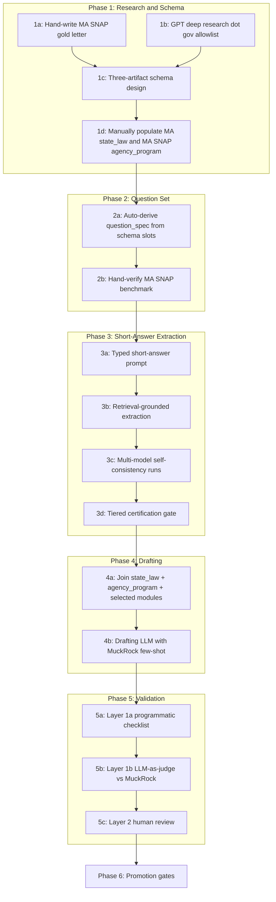

# Workflow Design V2 — Benefits Decoded Public Records Pipeline

> **Status:** supersedes [`workflow_design_V1.md`](workflow_design_V1.md). V1 is preserved alongside this document as a design history.
>
> **Precedence:** when this document conflicts with the proposal at `docs/Benefits_Decoded_Project_Proposal.pdf`, this document wins (per RA decision). The proposal sets the long-term scientific aims; V2 sets the engineering plan to reach them.
>
> **Pilot scope (this document):** **Massachusetts × SNAP only**, end-to-end through every phase. All examples, prompts, schemas, and validation gates target this single state-program cell. Multi-state and multi-program work is treated as a *promotion target* (see §9), not as V2 scope.

---

## 0. TL;DR

We are building a reproducible LLM-assisted pipeline that turns official state government webpages into validated, structured "Request Playbook" data, and turns that data into state-compliant public records request letters. V2 is a redesign of [V1](workflow_design_V1.md) with five principal changes:

1. **Vertical-slice pilot.** We instrument the entire pipeline on one cell — Massachusetts × SNAP — before we add a second state or a second program. Breadth comes only after the architecture is proven on depth.
2. **Three-artifact decomposition.** The single playbook schema in V1 is split into `state_law` (50 rows long-term), `agency_program` (~300 rows long-term), and `request_modules` (jurisdiction-independent content blocks). Cardinality, update cadence, and authorship differ across the three; mixing them creates duplication and drift risk.
3. **Spec-by-example before schema lock.** We hand-write a complete, submittable MA SNAP request letter *first*, then design the schema by decomposing that letter. This catches schema gaps for the cost of one afternoon of human research, instead of one weekend of LLM tokens.
4. **Short-answer typed extraction in Phase 3.** The current free-form "research and answer" prompt is replaced by a per-question-type prompt that constrains the LLM to a single typed value with explicit length and format limits (e.g., phone is exactly 10 digits, statute citation is one line ≤ 60 chars). This makes scoring near-deterministic and dramatically reduces matcher complexity in [`exp_results/score_experiments.py`](../exp_results/score_experiments.py).
5. **Two-layer programmatic-then-semantic validation.** Phase 5 runs a deterministic checklist (Layer 1a) before any LLM-as-judge cost is paid (Layer 1b), and only escalates to human review (Layer 2) for drafts that survive both.

The doc is organized as **plan → reasoning → deliverables** in every phase so it functions as a design rationale, not a checklist.

---

## 1. What changes from V1 — auditable delta

| Topic | V1 | V2 | Why we changed it |
|---|---|---|---|
| Pilot scope | 5 states × pilot programs (proposal-aligned) | **MA × SNAP single cell** end-to-end | Breadth-first means failures are confounded across states/programs; depth-first isolates the architectural failure mode. |
| Playbook schema | One schema per `(state, program, agency)` row, ~300 rows | **Three artifacts**: `state_law` (50), `agency_program` (300), `request_modules` (~6) | State-law facts duplicate 6× across programs in V1. Splitting eliminates drift and parallelizes research. |
| Schema design timing | Schema first, then research populates it | **Gold letter first, schema decomposed from it** | Catches missing slots cheaply; gives end-to-end ground truth for Phase 5. |
| Phase 3 prompt | Free-form "research and answer" with self-reported source | **Typed short-answer extraction** with length, format, and grounding constraints | Tight outputs collapse matcher complexity and reduce hallucination surface. |
| Source grounding | Self-reported source URL in the answer JSON | **Retrieval-grounded** (web-tool-enabled models for V2; external retrieval for V3) | Bounds the LLM to retrieved evidence, eliminates URL hallucination. |
| Certification criterion | Implicit: V1 §"Opt2" suggested ≥0.6 self-consistency on best model; proposal A1.3 says "100% agreement" | **Tiered: auto-certify / soft-certify / manual-queue**, combining cross-model + self-consistency + .gov source | 100% three-way agreement is unreachable per current Tier 1 results (Opus 76%, Gemma 44%, GPT-OSS 36%). Tiered criteria preserve volume while still routing hard cases to humans. |
| Validation | "MuckRock LLM-as-judge" + human review | **Layer 1a programmatic checklist → Layer 1b LLM-as-judge → Layer 2 human review** | Most missing-slot defects are deterministic; we shouldn't pay LLM cost for them. |
| Question set | Hand-curated list of example questions | **Auto-derived from schema slots**, one question per field with type-specific scoring | Keeps questions in lockstep with schema; refactor-safe. |
| Schema fields | 10 top-level keys | **Adds**: fee-waiver citation, expedited-processing citation, record definition, certification language, segregation clause, residency restriction, portal schema, state-specific quirks, plus reserved operational/tracking fields | Real FOIA letters (per FOIA Basics annotated request and BTAH model letter) need these to be valid. Reserved fields prevent schema migration pain when we add the campaign tracker. |
| Promotion logic | "Pilot then scale" (1-step) | **Four explicit gates** (v1 → v2 → v3 → scale) with quantitative pass criteria | Each gate adds one axis of variation, so failures are diagnosable to the dimension that changed. |
| Repo hygiene | `pipline/` (typo), `Drafting_prompt.text`, empty placeholders | **Recommends rename to `pipeline/`**, normalized prompt filenames, single canonical playbook artifact | Quality-of-life; not blocking but worth fixing before the doc tree calcifies. |

---

## 2. Architecture overview



Three things are flowing through the pipeline:
- **Structured facts** (state law, agency contacts) — produced in Phase 1, validated in Phase 3, consumed in Phase 4.
- **Modular content** (request modules per the proposal's A2.1 categories) — authored once, reused everywhere.
- **Letters** — composed in Phase 4, validated in Phase 5, sent in Phase 6+ (out of V2 scope).

---

## 3. Design principles

These principles will be repeated in shorthand at the bottom of each phase section.

1. **Composable templating.** The LLM does not invent facts; it composes prose from validated structured slots. This is V1's core insight and V2 keeps it intact.
2. **Three-artifact decomposition.** State-level legal facts, program-level operational facts, and content modules are different things and live in different files.
3. **Spec-by-example.** Hand-write the desired output before designing the structure that produces it.
4. **Bounded LLM tasks.** Phase 3 is "extract one typed value with grounding." Phase 4 is "compose prose from structured input with no invention." Phase 5a is fully deterministic. The LLM has a small, well-typed job at every step.
5. **Retrieval grounding wherever practical.** A self-reported source URL is not evidence; a quoted span fetched from a `.gov` page is.
6. **Programmatic-before-semantic validation.** Cheap deterministic checks gate expensive LLM-as-judge checks.
7. **Vertical pilot before horizontal scale.** Prove the architecture on MA SNAP before we add a state or a program.
8. **Auditability over cleverness.** Every cell in the playbook has a `source_url`, a `quote`, a `retrieved_at` timestamp, and a confidence tier; every generated letter has a snapshot of the inputs that produced it.

---

## 4. Pilot scope

V2's deliverables target **Massachusetts × SNAP** only. Concretely this means:

- One file at `pipeline/playbook/state_law/MA.json`.
- One file at `pipeline/playbook/agency_program/MA_SNAP.json`.
- One benchmark CSV at `pipeline/benchmarks/MA_SNAP_benchmark.csv`.
- One generated letter at `pipeline/generated_requests/MA_SNAP.txt` (plus snapshot).
- Modules in `pipeline/request_modules/` are written generically (jurisdiction-independent), but only verified against MA SNAP for V2.

Schemas at `pipeline/schemas/` are designed generically (so they work for all 50 states / 6 programs eventually), but only **populated** for MA SNAP in V2. Generality is in the schema; specificity is in the data.

---

## 5. Phase 1 — Research and Schema design

### 5.1 Step 1a — Spec-by-example: hand-write the MA SNAP gold letter

**Plan.** A human (RA) hand-writes one complete, submittable Massachusetts public records request letter targeting SNAP at the Department of Transitional Assistance (DTA). Every word in the letter is then annotated as one of three categories:

- `slot:<schema-field>` — varies across (state, program); pulled from the playbook (e.g., `slot:state_law.public_records_law.citation`).
- `module:<module-id>` — a content block authored once, applicable across jurisdictions (e.g., `module:vendors_contracts`).
- `boilerplate` — fixed wording that appears in every letter regardless of state or program (e.g., the closing courtesy line).

The annotated version is committed alongside the unannotated one. The two together are the **schema spec**.

**Reasoning.** This is the single highest-leverage step in V2.

- The cost is one afternoon of human research. The benefit is that every schema gap, every missing module, every state-specific quirk surfaces *now*, before any LLM extraction runs at scale.
- It also gives Phase 5 Layer 2 a concrete reference letter for edit-distance scoring. Without a gold letter, "is the LLM draft good?" is unanswerable.
- The annotation forces a binary decision per word: if a word doesn't fit `slot | module | boilerplate`, the schema is incomplete.

**Failure mode if skipped.** We design the schema in the abstract, run Phase 3 extraction, then in Phase 4 discover the LLM-drafted letter is missing a paragraph the state law actually requires. We then redesign the schema, re-run Phase 3 (re-paying token cost), and redo benchmarks.

**Deliverables.**
- [`pipeline/gold_letters/MA_SNAP.md`](pipeline/gold_letters/MA_SNAP.md) — the letter as it would be submitted.
- `pipeline/gold_letters/MA_SNAP.annotated.md` — the same letter with every word tagged.

**Cross-references for the human writer.**
- BTAH Public Records Request Guide model letter (Arkansas DHS example) — solid baseline format with named individuals and keyword strategy.
- FOIA Basics annotated tech FOIA request — definitions block, format-of-production block, fee-waiver block, expedited-processing block.
- NFOIC's MA-specific FOI sample letter — for state-statutory framing.
- An existing successful MuckRock SNAP request — for tone parity.

---

### 5.2 Step 1b — GPT deep research run

**Plan.** Run a focused deep research job to populate MA SNAP factual context. The prompt (proposed text below) constrains sources and demands per-field provenance.

**Proposed deep research prompt** (paste-ready):

```text
You are a policy research assistant compiling a structured factual brief
for a public records request directed at the Massachusetts Department of
Transitional Assistance (DTA), regarding the Supplemental Nutrition
Assistance Program (SNAP).

# Source constraints (HARD)
- Acceptable domains: *.gov, *.us, nfoic.org, btah.org, foiabasics.org,
  rcfp.org, muckrock.com.
- For every fact you report you MUST include:
    1. The exact source URL.
    2. A verbatim quoted span (1-3 sentences) from that URL that supports
       the fact. Do not paraphrase the quote.
    3. The date you accessed the source, in YYYY-MM-DD form.
- If you cannot find a fact in an acceptable source, write "NOT FOUND" for
  that field. Do not infer or fill in plausible-looking values.

# What I need (organized in two layers)

## Layer A: Massachusetts public records law (state-level facts)
1. Common name of the law (e.g., "Public Records Law").
2. Statutory citation (e.g., "M.G.L. c. 66, § 10").
3. Standard response deadline for an agency to acknowledge / respond to a
   public records request, in the form "N business days" or
   "N calendar days".
4. Extension clause, if any, in the same form.
5. Fee-waiver provision: is it available? Statutory citation if so.
   Categories of requesters who qualify (e.g., public-interest, news media,
   academic). Required assertions a requester must make to invoke it.
6. Expedited processing provision: available? Statutory citation? Criteria?
7. Appeal pathway: who hears appeals, what statutory citation, what deadline.
8. Definition of "public record" under MA law (paraphrase + citation).
9. Whether the requester must be a Massachusetts resident.
10. Required certification language, if any.
11. Segregation clause language, if any (i.e., the rule that exempt portions
    can be withheld but non-exempt portions must still be produced).
12. State-specific quirks the average requester might trip on.

## Layer B: SNAP administration in Massachusetts (program-level facts)
1. Administering agency, full name and abbreviation.
2. Sub-agency or division responsible for SNAP eligibility specifically.
3. Records Access Officer (RAO) name and title for that agency.
4. RAO contact: email, phone, mailing address.
5. Public records request portal URL, if any. If a portal is used, list
   the required fields the requester must complete.
6. Accepted submission methods (in-person, mail, email, portal, fax).
7. Common program aliases used by Massachusetts (e.g., "SNAP", "DTA SNAP",
   "food stamps").
8. Known SNAP eligibility / case-management system names used by DTA
   (e.g., "BEACON").
9. Known vendors or contractors associated with those systems.

## Layer C: Sanity check
Cross-check every Layer A entry against the National Freedom of Information
Coalition's MA page (nfoic.org). For any disagreement, list both values
and both sources.

## Layer D: MuckRock precedents
List 5 successful or partially-successful Massachusetts public records
requests from muckrock.com that:
- Targeted SNAP, DTA, or another MA benefits agency, OR
- Asked about algorithms, automated decision systems, or eligibility
  software in MA government.
For each, give the URL, the agency, the request date, and a 2-3 sentence
characterization of the request scope.

# Output format
Markdown, with headings matching Layer A / B / C / D and a table per layer
containing columns: Field, Value, Source URL, Quoted Span, Accessed.
```

**Reasoning.**
- The `.gov` allowlist is the cheapest hallucination guard for URLs; the verbatim quote requirement is the cheapest hallucination guard for facts.
- "Worked example for one cell first" (MA → schema → generalize) is more reliable than "design schema in the abstract."
- Asking deep research to cross-check against NFOIC catches disagreements early.
- Asking it to fetch 5 MuckRock precedents kills two birds: gives Phase 4 few-shot examples and Phase 5 LLM-as-judge exemplars.

**Failure mode if skipped.** We start Phase 3 extraction blind to which fields are even findable on MA's public sites, and waste runs on questions that have no answer at scale.

**Deliverables.**
- `pipeline/research/MA_SNAP_research.md` — the deep research output.
- `pipeline/validation/muckrock_examples/MA_SNAP_*.md` — the 5 MuckRock exemplars copied locally for Phase 5.

---

### 5.3 Step 1c — Three-artifact schema design

**Plan.** Three schema files, all generic across states and programs:

**`pipeline/schemas/state_law.schema.json`** — one row per state.

```json
{
  "$schema": "http://json-schema.org/draft-07/schema#",
  "type": "object",
  "required": ["state", "public_records_law"],
  "properties": {
    "state": { "type": "string", "minLength": 2, "maxLength": 2 },
    "public_records_law": {
      "type": "object",
      "required": ["name", "citation"],
      "properties": {
        "name": { "type": "string" },
        "citation": { "type": "string" },
        "response_deadline": {
          "type": "string",
          "description": "Primary deadline in form 'N business days' or 'N calendar days'."
        },
        "extension_clause": { "type": ["string", "null"] },
        "appeal_path": {
          "type": "object",
          "properties": {
            "venue": { "type": "string" },
            "citation": { "type": "string" },
            "deadline_days": { "type": ["integer", "null"] }
          }
        },
        "record_definition": { "type": ["string", "null"] },
        "fee_waiver": {
          "type": "object",
          "properties": {
            "available": { "type": "boolean" },
            "statutory_citation": { "type": ["string", "null"] },
            "qualifying_categories": { "type": "array", "items": { "type": "string" } },
            "required_assertions": { "type": "array", "items": { "type": "string" } }
          }
        },
        "expedited_processing": {
          "type": "object",
          "properties": {
            "available": { "type": "boolean" },
            "statutory_citation": { "type": ["string", "null"] },
            "criteria": { "type": "array", "items": { "type": "string" } }
          }
        },
        "certification_required": { "type": "boolean" },
        "certification_text": { "type": ["string", "null"] },
        "segregation_clause": { "type": ["string", "null"] },
        "residency_restriction": { "type": "boolean" },
        "state_specific_quirks": { "type": "array", "items": { "type": "string" } }
      }
    },
    "evidence": {
      "type": "array",
      "items": {
        "type": "object",
        "required": ["field", "source_url", "quote", "retrieved_at"],
        "properties": {
          "field": { "type": "string" },
          "source_url": { "type": "string", "format": "uri" },
          "quote": { "type": "string" },
          "retrieved_at": { "type": "string", "format": "date" }
        }
      }
    },
    "confidence": { "type": "string", "enum": ["high", "medium", "low"] },
    "needs_manual_review": { "type": "boolean" }
  }
}
```

**`pipeline/schemas/agency_program.schema.json`** — one row per (state, program).

```json
{
  "$schema": "http://json-schema.org/draft-07/schema#",
  "type": "object",
  "required": ["state", "program", "administering_agency"],
  "properties": {
    "state": { "type": "string" },
    "program": { "type": "string" },
    "program_aliases": { "type": "array", "items": { "type": "string" } },
    "administering_agency": {
      "type": "object",
      "required": ["name"],
      "properties": {
        "name": { "type": "string" },
        "abbreviation": { "type": ["string", "null"] }
      }
    },
    "sub_agency": { "type": ["string", "null"] },
    "records_officer": {
      "type": "object",
      "properties": {
        "name": { "type": ["string", "null"] },
        "title": { "type": ["string", "null"] }
      }
    },
    "contact": {
      "type": "object",
      "properties": {
        "email": { "type": ["string", "null"], "format": "email" },
        "phone": {
          "type": ["string", "null"],
          "pattern": "^[0-9]{10}$",
          "description": "Exactly 10 digits, no formatting."
        },
        "address_line1": { "type": ["string", "null"] },
        "address_line2": { "type": ["string", "null"] },
        "city": { "type": ["string", "null"] },
        "state": { "type": ["string", "null"] },
        "zip": { "type": ["string", "null"] }
      }
    },
    "portal": {
      "type": "object",
      "properties": {
        "name": { "type": ["string", "null"] },
        "url": { "type": ["string", "null"], "format": "uri" },
        "required_fields": { "type": "array", "items": { "type": "string" } }
      }
    },
    "submission_methods": {
      "type": "array",
      "items": { "type": "string", "enum": ["email", "mail", "portal", "fax", "in_person", "phone"] }
    },
    "known_system_names": { "type": "array", "items": { "type": "string" } },
    "known_vendors": { "type": "array", "items": { "type": "string" } },
    "keywords": { "type": "array", "items": { "type": "string" } },

    "_reserved_for_campaign_tracking": {
      "description": "Fields reserved for downstream Stage-2/3 use; do not populate in V2.",
      "properties": {
        "submission_status": { "type": "string", "enum": ["drafted","reviewed","sent","acknowledged","rolling","fulfilled","denied","appealed"] },
        "tracking_id": { "type": ["string", "null"] },
        "date_sent": { "type": ["string", "null"], "format": "date" },
        "date_first_response": { "type": ["string", "null"], "format": "date" },
        "date_final_response": { "type": ["string", "null"], "format": "date" },
        "appeal_status": { "type": ["string", "null"] }
      }
    },

    "evidence": {
      "type": "array",
      "items": {
        "type": "object",
        "required": ["field", "source_url", "quote", "retrieved_at"],
        "properties": {
          "field": { "type": "string" },
          "source_url": { "type": "string", "format": "uri" },
          "quote": { "type": "string" },
          "retrieved_at": { "type": "string", "format": "date" }
        }
      }
    },
    "confidence": { "type": "string", "enum": ["high", "medium", "low"] },
    "needs_manual_review": { "type": "boolean" }
  }
}
```

**`pipeline/schemas/request_modules.schema.yaml`** — one entry per content module.

```yaml
$schema: http://json-schema.org/draft-07/schema#
type: object
required: [id, title, request_text]
properties:
  id:
    type: string
    description: Stable slug, e.g. "ads_inventory".
  title:
    type: string
  request_text:
    type: string
    description: |
      The body of the request item, with placeholders in {{double-curly}} form.
      Placeholders are resolved at draft time from the joined playbook.
  parametrized_slots:
    type: array
    items: { type: string }
    description: |
      The placeholder names that appear in request_text, e.g.
      ["program", "state", "time_scope_start"].
  applicable_programs:
    type: array
    items: { type: string }
    description: Empty list = applies to all programs.
  required_state_features:
    type: array
    items: { type: string }
    description: |
      State-law features that must be present for this module to be valid.
      e.g. ["fee_waiver.available"] for the fee-waiver paragraph.
```

**Reasoning.**
- Splitting along cardinality and update cadence (50 vs. 300 vs. 6) is the cleanest decomposition. Editing MA's response deadline in V1 meant editing 6 program rows; in V2 it's one edit.
- `evidence` at the row level (not buried inside each field) makes it cheap to walk through every grounded claim during human review.
- Reserving operational fields now (under a clearly-marked `_reserved_for_campaign_tracking`) prevents a schema migration when Stage 2 of the project starts.
- YAML for modules (vs. JSON) is deliberate: modules are wordy text blocks; YAML's literal-string blocks (`|`) are kinder to writers than escaping JSON quotes.

**Deliverables.** Three schema files in `pipeline/schemas/`.

---

### 5.4 Step 1d — Manually populate MA SNAP playbook

**Plan.** Using the gold letter (1a) and deep research output (1b), a human writes:

- `pipeline/playbook/state_law/MA.json` — every Massachusetts state-law field, with `evidence[]` populated for each.
- `pipeline/playbook/agency_program/MA_SNAP.json` — every MA SNAP operational field, same evidence requirement.

Then run a structural validation: every `slot:<...>` annotation in `MA_SNAP.annotated.md` must resolve to a populated, non-null path in the joined playbook. Any unresolved annotation is a schema gap and triggers a return to step 1c.

**Reasoning.**
- Hand-written, evidence-cited playbook = the ground truth. Phase 3 evaluation in Phase 6's promotion criteria is "does the LLM extraction recover this hand-verified value?"
- The structural validation against the annotated gold letter is the **closure check** for V2's design phase. Until it passes, we don't move to Phase 2.

**Deliverables.** Two populated JSON files; one human-readable diff report showing all gold-letter slots are populated.

**Phase 1 design-principles check.**
- Composable templating? Yes — the playbook is the structured spine.
- Three-artifact decomposition? Yes — schemas split cleanly.
- Spec-by-example? Yes — gold letter precedes schema lock.
- Bounded LLM tasks? N/A — Phase 1 is mostly human + deep research.
- Retrieval grounding? Yes — every field has source URL + quote.
- Auditability? Yes — `evidence[]` on every row.

---

## 6. Phase 2 — Question set design

### 6.1 Step 2a — Auto-derive `question_spec.yaml` from schemas

**Plan.** Replace the hand-curated question list with a derivation: for each populated path in the schemas, emit one question spec.

**`pipeline/questions/question_spec.yaml`** structure (excerpt):

```yaml
- field_path: state_law.public_records_law.citation
  question_template: "What is the statutory citation for the public records law in {state}?"
  answer_format: statute_citation
  max_length: 60
  source_pattern: "^https?://(www\\.)?(malegislature\\.gov|mass\\.gov|nfoic\\.org)/"
  certification_threshold: high
  example_good: "M.G.L. c. 66, § 10"
  example_bad: "Massachusetts has a public records law that allows citizens to..."

- field_path: state_law.public_records_law.response_deadline
  question_template: "How many business or calendar days does an agency in {state} have to respond to a public records request?"
  answer_format: deadline_days
  max_length: 25
  source_pattern: "^https?://(www\\.)?(malegislature\\.gov|mass\\.gov|nfoic\\.org)/"
  certification_threshold: high
  example_good: "10 business days"
  example_bad: "10 business days, with a possible 20-day extension"

- field_path: agency_program.records_officer.email
  question_template: "What is the public records request email address for the agency that administers {program} in {state}?"
  answer_format: email
  max_length: 80
  source_pattern: "^https?://(www\\.)?(mass\\.gov)/"
  certification_threshold: high
  example_good: "publicrecords@dta.state.ma.us"
  example_bad: "You can email the records office; their address is on the agency website."

- field_path: agency_program.contact.phone
  question_template: "What phone number should the public use to contact the state-level agency that administers {program} in {state}?"
  answer_format: phone
  max_length: 10
  source_pattern: "^https?://(www\\.)?(mass\\.gov)/"
  certification_threshold: medium
  example_good: "8773822363"
  example_bad: "(877) 382-2363"
```

**Reasoning.**
- A single source of truth (`question_spec.yaml`) keeps Phase 2 in lockstep with Phase 1. When a schema field is added, one file changes and the rest of the pipeline picks it up.
- `answer_format` is the bridge between Phase 3 (prompts) and `score_experiments.py` (matchers). Today the matcher dispatch in [`exp_results/score_experiments.py:25-37`](../exp_results/score_experiments.py) classifies questions by keyword sniffing in the template; V2 makes this explicit and declarative.
- `source_pattern` is the cheapest sanity gate on URLs the LLM returns — if the source URL doesn't match, it doesn't count toward auto-certify.
- Per-question `certification_threshold` lets us be strict about high-stakes fields (statute citation, agency name) and tolerant about low-stakes ones (alias list).

### 6.2 Step 2b — Hand-verify the MA SNAP benchmark

**Plan.** Today's [`data/benchmark.csv`](../data/benchmark.csv) has 5 questions × 5 states (16 rows total). For V2 we extend the same wide-format sheet into a focused MA-SNAP-only file containing one row per question in `question_spec.yaml`.

**`pipeline/benchmarks/MA_SNAP_benchmark.csv`** columns:

```
field_path, question_template, program, state, ground_truth, source_url, quote, retrieved_at, answer_format
```

The `ground_truth` value is copied directly from the manually populated playbook (1d) — so the benchmark and the playbook are guaranteed consistent.

**Reasoning.**
- Phase 3 evaluation (and the scoring in [`exp_results/score_experiments.py`](../exp_results/score_experiments.py)) needs a reference value to compare against.
- Sourcing the benchmark from the populated playbook (rather than independently hand-writing it) eliminates an entire class of "playbook says X, benchmark says Y" inconsistency bugs.

**Phase 2 design-principles check.**
- Bounded LLM tasks? N/A — Phase 2 is all derivation.
- Auditability? Yes — every benchmark row carries source URL + quote.

**Deliverables.** `question_spec.yaml`, `MA_SNAP_benchmark.csv`.

---

## 7. Phase 3 — Short-answer typed extraction

This is the redesigned core of V2. Today's [`exp_results/run_experiment.py:28-36`](../exp_results/run_experiment.py) `SYSTEM_PROMPT` asks the model to "answer the question" and self-report a source. V2 replaces this with a typed extraction that returns a single short value.

### 7.1 Step 3a — Per-question-type answer taxonomy

The full taxonomy V2 commits to:

| `answer_format` | Allowed shape | Max length | Example good | Example bad |
|---|---|---|---|---|
| `agency_full_name` | Free string with optional `(ABBREV)` parenthetical | 120 chars | `Massachusetts Department of Transitional Assistance (DTA)` | `The DTA is responsible for SNAP in Massachusetts.` |
| `agency_abbreviation` | 2-6 uppercase letters | 6 chars | `DTA` | `Department of Transitional Assistance` |
| `officer_name` | 1-4 words, letters / dots / hyphens / spaces only | 60 chars | `Sarah Coleman` | `The records officer (you can find their name on the website)` |
| `officer_title` | 2-8 words | 80 chars | `Records Access Officer` | `The person responsible for handling records requests is...` |
| `email` | Single RFC-5322 email, lowercase normalized | 80 chars | `publicrecords@dta.state.ma.us` | `Email the agency at the address listed online.` |
| `phone` | Exactly 10 digits, no formatting | 10 chars | `8773822363` | `(877) 382-2363` |
| `street_address` | Single line | 80 chars | `600 Washington Street, Boston, MA 02111` | `It's at the DTA central office on Washington Street.` |
| `po_box` | `PO Box {N}` exactly | 20 chars | `PO Box 4406` | `P.O. Box four-four-zero-six` |
| `zip5` | 5 digits | 5 chars | `02111` | `02111-1234` |
| `zip9` | `NNNNN-NNNN` | 10 chars | `02111-1234` | `02111` |
| `statute_citation` | One line, state-specific format | 60 chars | `M.G.L. c. 66, § 10` | `Mass General Laws chapter 66 section 10` |
| `deadline_days` | `N business days` or `N calendar days` exactly, primary deadline only | 25 chars | `10 business days` | `10 business days, with possible 20-day extension` |
| `extension_days` | Same shape, separate field | 25 chars | `20 business days` | `up to 20 additional business days` |
| `boolean` | `yes` or `no` exactly | 3 chars | `yes` | `In most cases, yes.` |
| `enum` | One token from a per-question allowed list | varies | `email` | `you can submit by email or mail` |
| `url` | Single absolute URL | 200 chars | `https://www.mass.gov/forms/public-records-request` | `Visit mass.gov and search for public records.` |
| `multi_field` | JSON object with named keys, each conforming to one of the above | 400 chars | `{"name": "Sarah Coleman", "title": "Records Access Officer"}` | A natural-language paragraph |
| `not_available` | Sentinel: `value: null`, `reason: <short string>` | n/a | `{"value": null, "reason": "no MA-specific SNAP RAO published"}` | `I don't know.` |

**Reasoning.**
- Today's matcher in [`exp_results/score_experiments.py:59-83`](../exp_results/score_experiments.py) has to disambiguate primary vs. extension deadlines using regex disqualifiers (`additional`, `extend`, `extra`, `more`, `further`). With `deadline_days` returning *only the primary deadline*, that whole disambiguation goes away.
- Splitting `deadline_days` and `extension_days` into two fields is the right factoring; today's CSV stores them as one composite string that the matcher has to parse.
- `phone` returning exactly 10 digits eliminates the formatting normalization at [`exp_results/score_experiments.py:113-124`](../exp_results/score_experiments.py).
- `not_available` as a first-class sentinel encourages the model to abstain rather than fabricate. This is the single biggest hallucination control.
- Per-format examples (good and bad) in `question_spec.yaml` get embedded in the prompt at runtime, making the constraint explicit at the point of generation.

### 7.2 Step 3b — Short-answer extraction prompt skeleton

**Plan.** The new prompt (V2 publishes it inline; eventual file is `pipeline/prompts/extraction_short_answer.txt`).

**System prompt:**

```text
You are a fact extractor for a public records research project.
Your single task: return one TYPED, SHORT answer for the question, grounded in
an OFFICIAL government source.

Hard rules:
- Use ONLY official U.S. state government sources (.gov / .us domains) and a
  small allowlist of public-interest sources provided in the user message.
- Return a single typed value matching the requested answer_format. No prose,
  no explanation, no qualifiers, no surrounding sentences.
- If you cannot find the value in an official source, return value=null with
  a short reason. Do NOT guess.
- The "quote" field MUST be a verbatim substring of the page at "source_url".
  Do not paraphrase.

Output: a single JSON object, no markdown fences, with exactly these keys:
  {
    "value": <typed value matching answer_format, or null>,
    "source_url": <URL string, or null if value is null>,
    "quote": <verbatim quoted span from the source, or null>,
    "retrieved_at": <YYYY-MM-DD>,
    "confidence": "high" | "medium" | "low",
    "reason": <short string, only if value is null>
  }
```

**User prompt template:**

```text
Question: {question}
State: {state_full_name}
Program: {program}
Answer format: {answer_format}
Maximum length: {max_length} characters
Constraints: {format_constraints}
Allowed source domains: {source_pattern_human_readable}
Example of a well-formed answer: {example_good}
Example of a malformed answer that you must NOT produce: {example_bad}

Return a single JSON object exactly as specified by the system prompt.
```

**Worked example — "What is the public records officer email for MA SNAP?"**

Resolved user prompt:

```text
Question: What is the public records request email address for the agency
that administers SNAP in Massachusetts?
State: Massachusetts
Program: SNAP
Answer format: email
Maximum length: 80 characters
Constraints: A single RFC-5322 email address, lowercase. No surrounding text,
no "mailto:" prefix, no commentary.
Allowed source domains: mass.gov, dta.state.ma.us
Example of a well-formed answer: publicrecords@dta.state.ma.us
Example of a malformed answer that you must NOT produce: "You can email the
DTA records office; their address is listed on the public records page."

Return a single JSON object exactly as specified by the system prompt.
```

Expected model output:

```json
{
  "value": "publicrecords@dta.state.ma.us",
  "source_url": "https://www.mass.gov/lists/department-of-transitional-assistance-records-access-officers",
  "quote": "Public records requests for the Department of Transitional Assistance can be submitted by email to publicrecords@dta.state.ma.us.",
  "retrieved_at": "2026-04-28",
  "confidence": "high"
}
```

**Reasoning.**
- The output schema is enforced by the prompt and validated programmatically post-hoc; if the JSON is malformed or `value` violates the format, the run is treated as a parse error and re-tried with a back-off, mirroring today's [`exp_results/run_experiment.py:79-135`](../exp_results/run_experiment.py) retry logic.
- Including `example_good` and `example_bad` is the cheapest in-context conditioning we have. It's worth ~10 lines of prompt to save dozens of malformed runs.
- The `not_available` sentinel + `confidence` field lets the certification gate (3d) make tiered decisions instead of forcing a binary correct/incorrect.

### 7.3 Step 3c — Retrieval grounding

**Plan.** For V2 pilot, use **web-tool-enabled model variants** for Phase 3:
- Anthropic Claude Opus 4.7 with web tool.
- OpenAI GPT-5-class with web search.
- Google Gemini 2.x-class with grounding.

These models execute the retrieve-then-answer loop inside their own tool calls, so we can keep the existing OpenRouter-based orchestration in [`exp_results/run_experiment.py`](../exp_results/run_experiment.py) (or a fork) without building a separate retriever layer.

**V3 upgrade path** (out of V2 scope): switch to external retrieval — use Tavily/Bing/Google Programmable Search filtered to `.gov`, fetch top-N HTML, pass content + question to non-tool models. This will be cheaper at scale and gives us deterministic source selection.

**Reasoning.**
- Building a retriever is real engineering work and not the bottleneck for the pilot. The bottleneck is verifying the *architecture* (typed extraction + tiered certification + programmatic validation) works; web-tool-enabled models suffice for that.
- We'll measure on MA SNAP whether grounded extraction outperforms today's free-form recall. If yes, the V3 retriever is justified.

### 7.4 Step 3d — Multi-model self-consistency runs

**Plan.** Reuse [`exp_results/run_experiment.py`](../exp_results/run_experiment.py) (with a small fork that accepts the new prompt template) and [`exp_results/summarize_experiments.py`](../exp_results/summarize_experiments.py) as-is.

- Default: 3 models × 5 runs each per question = 15 calls per question.
- Models: Claude Opus 4.7 (paid), GPT-5-class (paid), Gemini 2.x-class (paid or free as available on OpenRouter).
- Self-consistency: for each (model, question), the majority value across 5 runs.
- Cross-model: for each question, the majority of the three models' majorities.

For MA SNAP at ~25 fields populated this is ~375 calls — comparable to today's pilot run cost.

**Reasoning.**
- Self-consistency catches LLM-generated noise (the same model giving different answers on different runs).
- Cross-model agreement catches model-specific knowledge gaps (one model doesn't know MA's RAO email even after retrieval).
- The two signals are orthogonal; using both is the cheapest way to identify hard cells.

### 7.5 Step 3e — Tiered certification gate

**Plan.** Each cell of the Phase 3 output table gets one of three labels:

| Tier | Rule | Fate |
|---|---|---|
| **Auto-certify** | cross-model majority agrees AND best-model self-consistency ≥ 0.6 AND ≥1 source in allowed domains | Written to playbook with `confidence: "high"`, `needs_manual_review: false`. |
| **Soft-certify** | exactly one of those signals fails | Written to playbook with `confidence: "medium"`, `needs_manual_review: false`, but flagged in a separate audit log. |
| **Manual queue** | ≥ 2 signals fail | Written to playbook with `value: null`, `needs_manual_review: true`. Human fills in. |

**Per-field overrides** (set in `question_spec.yaml`):
- `certification_threshold: high` (mission-critical fields like `state_law.public_records_law.citation`, `agency_program.administering_agency.name`) — auto-certify only.
- `certification_threshold: medium` (most fields) — auto-certify or soft-certify acceptable.
- `certification_threshold: low` (tolerant fields like alias lists, keyword lists) — even one-signal-passing accepted.

**Reasoning.**
- The proposal A1.3 specifies "100% agreement across LLMs and with the benchmark test set." Per the README's preliminary results ([`README.md` lines 49-53](../README.md)), no model is at 100%; Opus is at 76%. A literal reading of A1.3 would certify almost nothing. V1's "Opt2" already proposed softening this; V2 makes the softening explicit and tiered.
- The three signals (cross-model, self-consistency, source domain) are orthogonal and each catches a different failure mode.
- Per-field thresholds prevent a single global threshold from being too lax for high-stakes fields or too strict for tolerant ones.

**Phase 3 design-principles check.**
- Bounded LLM tasks? Yes — one typed value per call.
- Retrieval grounding? Yes — web-tool-enabled models for V2.
- Auditability? Yes — every cell has source URL, quote, confidence, certification tier.

**Deliverables.**
- `pipeline/prompts/extraction_short_answer.txt` — the full prompt.
- A fork of `run_experiment.py` (call it `run_extraction.py`) wired to the new prompt + `question_spec.yaml`.
- Output CSVs in the existing `exp_results/` shape so today's analysis tiers continue to work.

---

## 8. Phase 4 — Drafting

### 8.1 Step 4a — Drafting prompt redesign

**Plan.** Replace [`pipline/Drafting_prompt.text`](Drafting_prompt.text) with a structured prompt at `pipeline/prompts/drafting_prompt.txt`.

**System prompt:**

```text
You are a legal writing assistant composing a public records request letter.

Hard rules:
- Compose ONLY from the structured input provided. Do not invent, infer, or
  add facts.
- Every required slot listed in <required_slots> MUST appear in the letter,
  with the EXACT value from <playbook>. Forbidden phrases: "the agency",
  "the relevant statute", "the appropriate office" - these indicate a
  missing slot.
- Use the modules in <selected_modules> as the body of the request. Resolve
  {{double-curly}} placeholders from <playbook>.
- Output two parts in order:
    1. The letter, between <letter></letter> tags.
    2. A validation block, between <validation></validation> tags, listing
       every required slot and the location in the letter where it appears,
       in JSON.
```

**User prompt template:**

```text
<schema_explanation>
state_law      = state-level legal facts (citation, deadline, fee waiver, etc.)
agency_program = program-specific facts (recipient, RAO, contact, portal)
modules        = numbered request items asking for specific record categories
</schema_explanation>

<playbook>
{joined_state_law_and_agency_program_json}
</playbook>

<selected_modules>
{list_of_module_yaml_blocks}
</selected_modules>

<required_slots>
{list_of_slot_paths}
</required_slots>

<few_shot>
Example 1: <input_json> ... </input_json> -> <letter> ... </letter>
Example 2: <input_json> ... </input_json> -> <letter> ... </letter>
</few_shot>

Compose the letter now.
```

**Reasoning.**
- Forbidding placeholder phrases like "the agency" is the cheapest way to detect a missing slot — Phase 5a checks for them.
- The `<validation>` JSON block makes Phase 5a deterministic: instead of pattern-matching the letter, we parse the validation block and check each declared slot location exists.
- Few-shot from real successful MuckRock requests (gathered in 1b Layer D) is the strongest single quality lever for the drafting model.

### 8.2 Step 4b — `generate_request.py` outline

**Plan.** A new script that:

1. Loads `pipeline/playbook/state_law/MA.json` and `pipeline/playbook/agency_program/MA_SNAP.json`; joins into one dict.
2. Selects modules: for the MA SNAP pilot, all six (ADS inventory, vendors/contracts, audits/evaluations, policies/manuals, decision workflows) per the proposal A2.1.
3. Renders the drafting prompt with the joined playbook + modules + required-slot list + 2-3 few-shot examples loaded from `pipeline/validation/muckrock_examples/`.
4. Calls the drafting LLM (single model: Claude Opus 4.7 or equivalent).
5. Parses the `<letter>` and `<validation>` tags.
6. Writes:
   - `pipeline/generated_requests/MA_SNAP.txt` — the letter.
   - `pipeline/generated_requests/MA_SNAP.snapshot.json` — `{playbook, selected_modules, prompt_hash, model, timestamp, validation_block}` so the draft is fully reproducible.

**Reasoning.**
- The snapshot is the auditability hook. Six months later we can re-render the same letter from the same inputs and confirm the LLM is deterministic-enough; or we can re-run with updated playbook data and diff the letters.
- Single model (not multi-model + majority) at this stage because composition is not the failure mode — the playbook data is. Phase 3 already did the multi-model work.

**Phase 4 design-principles check.**
- Bounded LLM tasks? Yes — composition only, no fact invention.
- Auditability? Yes — full snapshot per draft.

**Deliverables.** `pipeline/prompts/drafting_prompt.txt`, `pipeline/generate_request.py`, `pipeline/generated_requests/MA_SNAP.{txt,snapshot.json}`.

---

## 9. Phase 5 — Validation

### 9.1 Step 5a — Layer 1a: programmatic checklist (deterministic, free)

**Plan.** A pure-Python script `pipeline/validation/layer1a_checklist.py` that takes `(letter, snapshot)` and runs:

| Check | Implementation |
|---|---|
| Statute citation present once | `state_law.public_records_law.citation` substring count == 1 in letter. |
| Recipient address block matches | Joined `agency_program.contact.address_*` fields all appear in the letter. |
| RAO name and title appear | If `agency_program.records_officer.{name,title}` is non-null, both must appear. |
| Time scope is concretely dated | Regex for `\b(January\|February\|...\|December)\s+\d{1,2},\s+\d{4}\b` finds at least one date. |
| Delivery format named | At least one of {electronic, PDF, email, mail} present. |
| Fee-waiver paragraph iff `fee_waiver.available` | Mutual implication; substring check on `fee_waiver.statutory_citation`. |
| Certification clause iff state requires | Substring match on `certification_text`. |
| No forbidden placeholder phrases | Regex for `\b(the agency\|the relevant statute\|the appropriate office)\b` returns 0 matches. |
| Validation block round-trip | Each slot listed in `<validation>` is found at the declared location. |

Failure mode: any failed check returns the draft to Phase 4 with a structured error list. No LLM cost for re-drafting until human inspection if the same check fails twice.

**Reasoning.**
- Most defects in LLM-generated letters are of the "forgot to put in slot X" variety — that's deterministic and cheap to catch.
- Returning structured errors (rather than free-text feedback) means Phase 4 can re-prompt the LLM with "Fix these 3 specific issues" rather than "Try again."

### 9.2 Step 5b — Layer 1b: LLM-as-judge against MuckRock precedents

**Plan.** Only invoked if Layer 1a passes. The judge LLM gets:
- The candidate draft.
- 3 hand-picked successful MuckRock SNAP/benefits requests from `pipeline/validation/muckrock_examples/`.
- A structured prompt asking for a JSON diff: missing sections, scope mismatches, tone deviations.

**Judge prompt skeleton:**

```text
You are reviewing a public records request draft against successful
real-world precedents.

Compare the candidate draft against the precedents on three dimensions:
- structural completeness (does it have the same major sections?)
- scope specificity (is it as specific about records as the precedents?)
- tone (is the formality and assertiveness comparable?)

Return JSON only:
{
  "structural_completeness": {"score": 0-5, "missing": [...]},
  "scope_specificity":       {"score": 0-5, "vague_items": [...]},
  "tone":                    {"score": 0-5, "deviations": [...]}
}
```

**Reasoning.**
- 1a catches structural omissions. 1b catches the things humans actually notice: the request is too vague, the tone is wrong, a section a successful requester would include is missing.
- JSON-only output makes the gate machine-readable for Phase 6 promotion-gate dashboards.

### 9.3 Step 5c — Layer 2: human review

**Plan.** A human (RA) compares the draft against `pipeline/gold_letters/MA_SNAP.md` from Phase 1a:
- Compute character-level edit distance.
- Section-level diff.
- Record acceptance status: `accepted_as_is | accepted_with_minor_edits | major_rewrite_required | rejected`.

**Pilot acceptance criterion:** ≤ 20% character edits to convert LLM draft into the human-approved final.

**Reasoning.**
- The gold letter is the *operational* quality target — the letter we'd actually want to send. Edit-distance to the gold is the most direct metric we have.
- Categorical acceptance status feeds promotion-gate dashboards.

**Phase 5 design-principles check.**
- Programmatic-before-semantic? Yes — Layer 1a gates Layer 1b which gates Layer 2.
- Auditability? Yes — every review produces a structured record.

**Deliverables.** `pipeline/validation/layer1a_checklist.py`, `pipeline/validation/layer1b_judge_prompt.txt`, `pipeline/validation/muckrock_examples/`, plus a human review log per draft.

---

## 10. Phase 6 — Promotion gates

V2 itself stops at MA SNAP. Promotion to broader scope is gated by quantitative criteria.

| Gate | Scope | Pass criterion |
|---|---|---|
| **Pilot v1** (this doc) | MA × SNAP, single cell | (a) 100% of words in the gold letter trace to a slot, module, or boilerplate; (b) ≥ 80% of fields auto-certified in Phase 3; (c) Phase 5 Layer 2 acceptance is "accepted with minor edits" or better. |
| **Pilot v2** | MA × {SNAP, Medicaid, WIC, LIHEAP, TANF, CHIP} | (a) ≥ 80% of LLM drafts accepted with ≤ 20% character edits; (b) Layer 1a passes ≥ 95% of drafts on first try. |
| **Pilot v3** | 5 states × 2 programs (= original proposal A2.3 pilot scope) | Real-submission response rate ≥ 60% within statutory window; tracking for acknowledgements, fee estimates/waivers, clarifications, productions, denials, appeals. |
| **Scale** | 50 states × 6 programs | Meets v3 criterion as the steady-state rate. |

**Reasoning.** Each gate adds **one** axis of variation, so when something breaks we know which dimension caused it:
- v1 → v2 adds programs (within MA) — exposes whether modules are truly program-agnostic.
- v2 → v3 adds states — exposes whether `state_law` and `agency_program` schemas generalize.
- v3 → scale adds real-world response feedback — exposes whether the letters actually work.

---

## 11. Open risks and mitigations

| Risk | Likelihood | Mitigation |
|---|---|---|
| Some states / agencies require submission via a portal (NextRequest, JustFOIA, custom forms), not free-text email | High at scale | `agency_program.portal.required_fields` field reserved in V2; portal-driven submission gets a separate v3 sub-workflow that maps slots → form fields. |
| Residency-restricted states (historically AR, TN, VA at various times) refuse non-resident requests | Low for SNAP-administering agencies, but real | `state_law.residency_restriction` boolean flagged; partner with in-state organizations per proposal §2.4. |
| State agencies route SNAP to county offices (notably CA, NY) | Medium | `agency_program.sub_agency` captures this; module `recipient_block` handles county-level recipient lines. |
| Government webpages change, breaking source URLs | Medium | `evidence[].retrieved_at` lets us detect staleness; periodic re-extraction. |
| MuckRock precedents become outdated relative to current law | Low (slow drift) | Periodically refresh `muckrock_examples/`; date-tag each example. |
| LLM hallucinates source URLs that 404 | Medium | Source URL pattern check in `question_spec.yaml`; future: add HTTP-status check before accepting a citation. |
| Cost of multi-model × 5-runs at scale | Medium for 50-state | Per-field certification thresholds reduce the multi-model burden on tolerant fields; web-tool-enabled models will cost more per call but reduce need for re-runs. |
| Schema drift between V2 and V3 (when retrieval is added) | Low | V2 schemas already accommodate retrieval (the `evidence[]` shape doesn't change). |

---

## 12. Repository cleanup checklist

V2 recommends, in priority order:

1. **Rename `pipline/` → `pipeline/`.** Single typo; affects every file path in this doc. Recommended before the doc tree calcifies, but not blocking V2.
2. **Move prompts under `pipeline/prompts/`** with consistent names: `extraction_short_answer.txt`, `drafting_prompt.txt`, `judge_prompt.txt`. Replaces today's [`pipline/Drafting_prompt.text`](Drafting_prompt.text) and the empty [`pipline/questions_prompt.txt`](questions_prompt.txt).
3. **Promote `request_playbook.json` to a derived rendering.** The schemas and per-row playbook files are canonical; today's empty placeholders [`pipline/request_playbook.json`](request_playbook.json) and [`pipline/request_playbook.csv`](request_playbook.csv) should be deleted (and any export needed regenerated from the schemas).
4. **Long-term: move benchmark from `data/` to `pipeline/benchmarks/`.** V2 doesn't require this immediately to avoid breaking today's runners ([`exp_results/run_experiment.py`](../exp_results/run_experiment.py), [`exp_results/score_experiments.py`](../exp_results/score_experiments.py)), but the canonical home for question-set artifacts is the pipeline tree.

---

## 13. Proposed repository layout

```
pipeline/                                    # was pipline/
├── workflow_design_V2.md                    # this doc
├── workflow_design_V1.md                    # kept as design history
├── gold_letters/
│   ├── MA_SNAP.md                           # Phase 1a
│   └── MA_SNAP.annotated.md
├── research/
│   └── MA_SNAP_research.md                  # Phase 1b
├── schemas/
│   ├── state_law.schema.json                # Phase 1c
│   ├── agency_program.schema.json
│   └── request_modules.schema.yaml
├── playbook/
│   ├── state_law/MA.json                    # Phase 1d
│   └── agency_program/MA_SNAP.json
├── request_modules/                         # written generically
│   ├── ads_inventory.yaml
│   ├── vendors_contracts.yaml
│   ├── audits_evaluations.yaml
│   ├── policies_manuals.yaml
│   └── decision_workflows.yaml
├── questions/
│   └── question_spec.yaml                   # Phase 2a
├── benchmarks/
│   └── MA_SNAP_benchmark.csv                # Phase 2b
├── prompts/
│   ├── extraction_short_answer.txt          # Phase 3a/3b
│   └── drafting_prompt.txt                  # Phase 4a
├── generate_request.py                      # Phase 4b
├── generated_requests/
│   ├── MA_SNAP.txt
│   └── MA_SNAP.snapshot.json
└── validation/
    ├── layer1a_checklist.py                 # Phase 5a
    ├── layer1b_judge_prompt.txt             # Phase 5b
    └── muckrock_examples/
        └── ma_snap_*.md                     # Phase 1b Layer D output
```

---

## 14. Out of scope (explicit)

V2 deliberately does **not** cover:

- **Stage 3 / Aim 3** — agency response document ingestion, OCR, sensitive-info screening, claim extraction. Separate design doc.
- **Submission tracking dashboard / database UI** — fields are reserved in `agency_program.schema.json` under `_reserved_for_campaign_tracking` but no tooling.
- **Federal FOIA requests** — V2 focuses on state public-records laws.
- **Cost projections / token-budget modeling** — separate exercise after pilot v1 produces real numbers.
- **Multi-state, multi-program data** — promotion to that scope is gated per §10.

---

## 15. What I need from you (the RA / PI) to proceed

To kick off Phase 1a immediately:

1. **Confirm the rename `pipline/` → `pipeline/`** can happen now, or that we should defer (V2 lives in `pipline/` either way until then).
2. **Confirm the 3-model lineup** for Phase 3: Claude Opus 4.7, GPT-5-class, Gemini 2.x-class — all with web tools. Or different.
3. **Provide 1-2 successful MuckRock requests you consider exemplary** for SNAP / benefits-tech advocacy (else I'll pick from deep research Layer D output).
4. **Confirm whether Phase 1a (gold letter) is a human deliverable** the RA produces, or whether you want me to draft a first cut for review.
5. **Confirm OpenRouter is the API surface** for Phase 3 (or are we adding direct provider clients for the web-tool-enabled variants)?

Everything else V2 specifies has a defensible default; these five are the ones where your preference materially changes the build order.
