# Benefits Decoded: LLM benchmark analysis

Tiered analysis of the 375 raw LLM runs (75 cells x 5 runs) behind `exp_results/LLM_experiments.csv`. Regenerate with `python exp_analysis/run_all_tiers.py --tier all`.

## Tier 1 - Headline accuracy

- Claude Opus 4.7: 19/25 (76%, 95% CI 57%-89%)
- Gemma 4 26B: 11/25 (44%, 95% CI 27%-63%)
- GPT-OSS 120B: 9/25 (36%, 95% CI 20%-55%)
- Easiest question type: agency (15/15); hardest: email (2/15).
- Best-worst model gap: Claude Opus 4.7 76% vs GPT-OSS 120B 36% (+40%).

### Plots

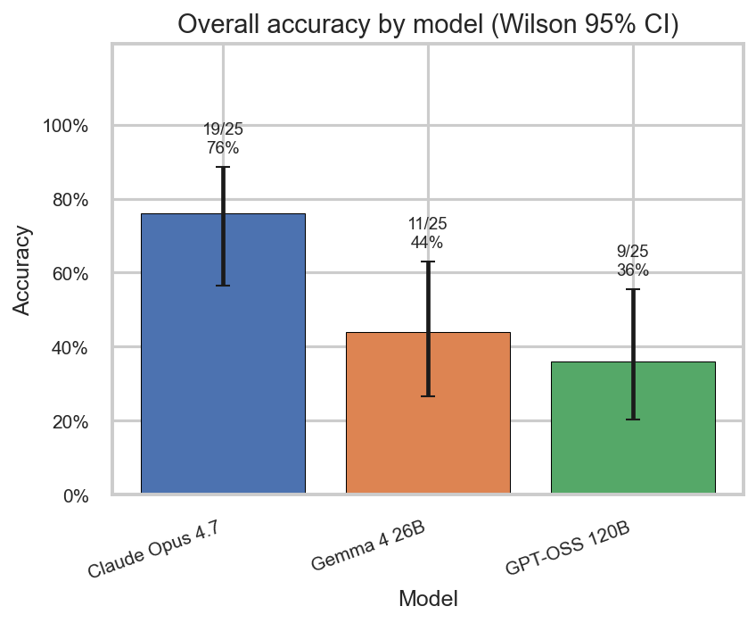

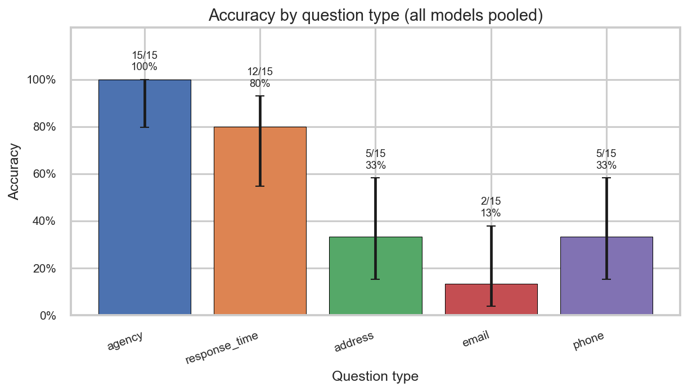

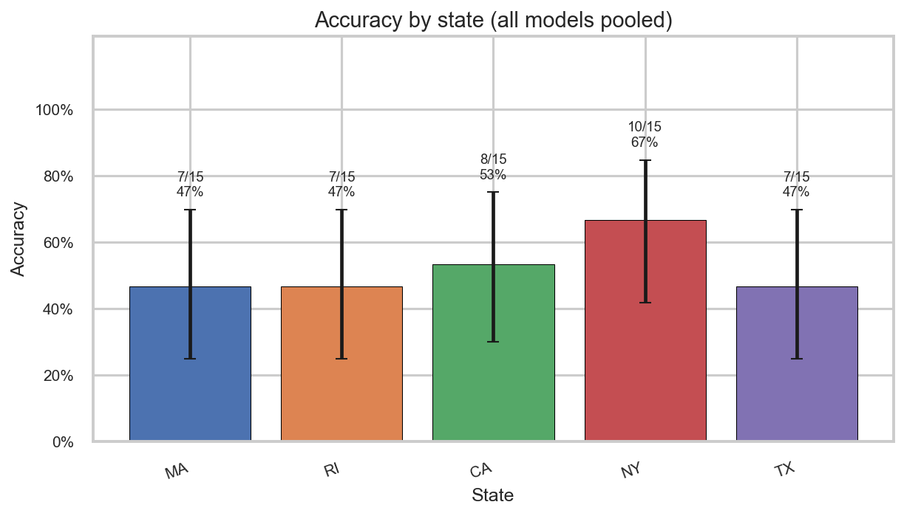

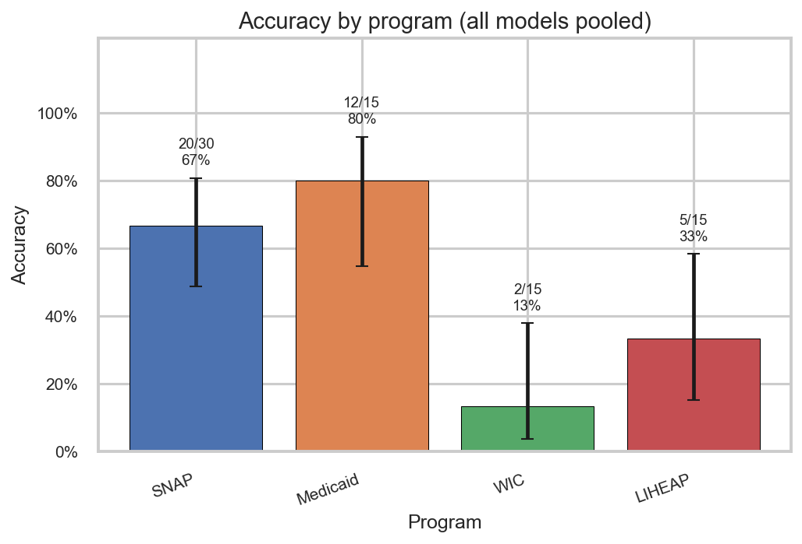

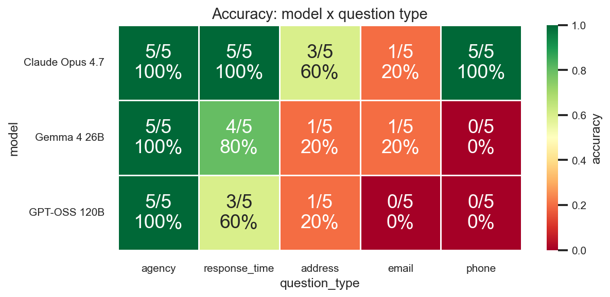

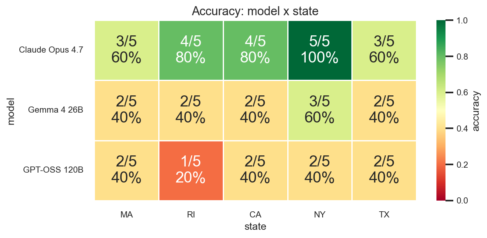

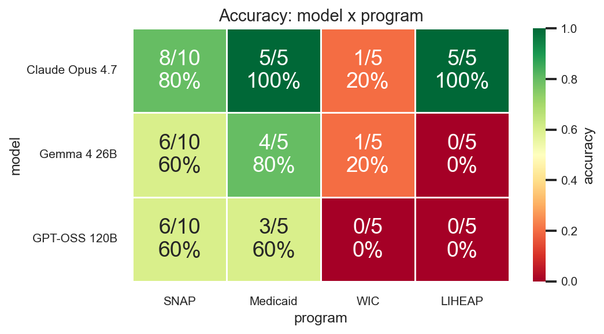

### Tables (Markdown renderings)

- [t1_01_leaderboard_by_model](tables/tier1/t1_01_leaderboard_by_model.md)
- [t1_02_accuracy_by_question_type](tables/tier1/t1_02_accuracy_by_question_type.md)
- [t1_03_accuracy_by_state](tables/tier1/t1_03_accuracy_by_state.md)
- [t1_04_accuracy_by_program](tables/tier1/t1_04_accuracy_by_program.md)
- [t1_05_heatmap_model_x_qtype_correct](tables/tier1/t1_05_heatmap_model_x_qtype_correct.md)
- [t1_05_heatmap_model_x_qtype_rates](tables/tier1/t1_05_heatmap_model_x_qtype_rates.md)

## Tier 2 - Calibration & self-consistency

- Mean agreement (Claude Opus 4.7): 0.49 (median 0.40)
- Mean agreement (Gemma 4 26B): 0.23 (median 0.20)
- Mean agreement (GPT-OSS 120B): 0.23 (median 0.20)
- Calibration: confidence=high covers 330 runs with only 54% per-run accuracy (95% CI 48%-59%).
- Cells where all 5 runs agree (bin 1.00): 5/5 correct (100%); cells with bin 0.20: 20/52 (38%).
- Mean distinct answers per cell: 2.77 of 5; 25/75 cells have all 5 runs identical after normalization.

### Plots

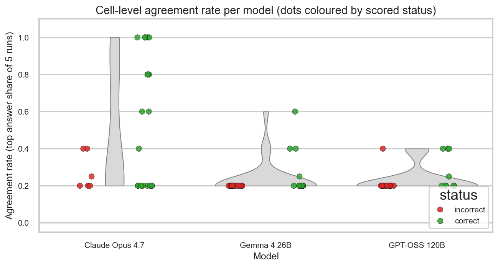

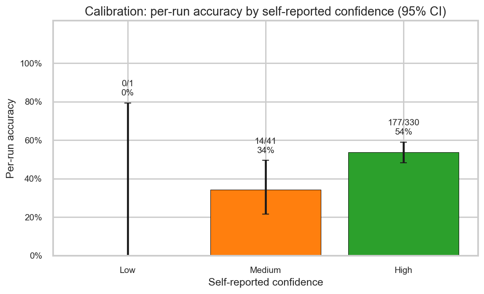

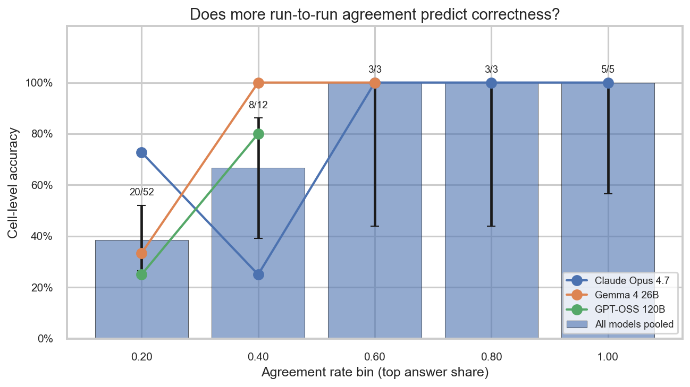

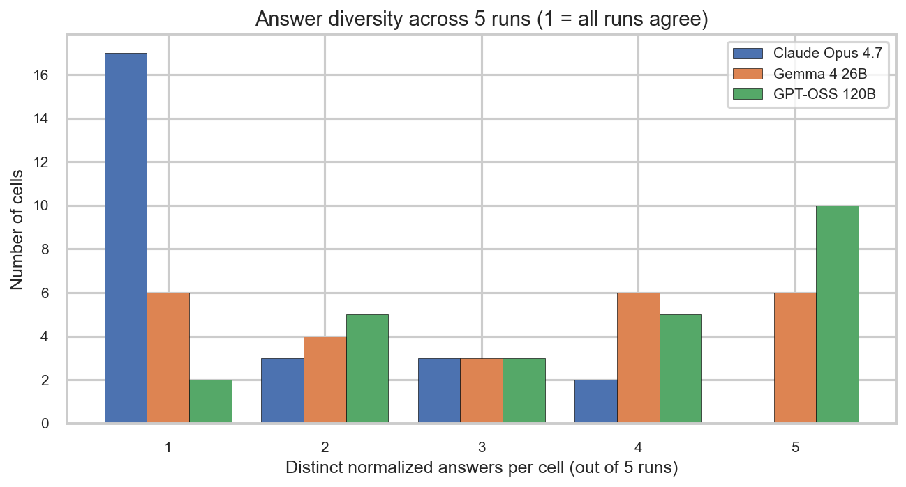

### Tables (Markdown renderings)

- [t2_01_agreement_rate_stats](tables/tier2/t2_01_agreement_rate_stats.md)
- [t2_02_confidence_calibration](tables/tier2/t2_02_confidence_calibration.md)
- [t2_03_agreement_vs_accuracy](tables/tier2/t2_03_agreement_vs_accuracy.md)
- [t2_04_answer_diversity_per_cell](tables/tier2/t2_04_answer_diversity_per_cell.md)
- [t2_04_top_unstable_cells](tables/tier2/t2_04_top_unstable_cells.md)

## Tier 3 - Error taxonomy & consolidation gap

- 6 of 25 cells are incorrect across ALL 3 models; 9 are correct across all 3.
- Among 36 incorrect cells, 9 contain a ground-truth fragment (e.g. ZIP, PO box number, email domain) - possible matcher strictness.
- Claude Opus 4.7: pass@1=74%, maj@5=76%, pass@5=76% -> oracle gap=+0%
- Gemma 4 26B: pass@1=42%, maj@5=44%, pass@5=48% -> oracle gap=+4%
- GPT-OSS 120B: pass@1=37%, maj@5=36%, pass@5=48% -> oracle gap=+12%

Each (model, question_template, program, state) cell was run 5 times. The three metrics capture different aggregation strategies over those 5 runs:

- **pass@1** - mean per-run accuracy: the probability that a single sampled run is correct, averaged over all 5 runs of each cell.
- **maj@5** - majority-vote accuracy: a cell is correct if the modal (most common) answer across its 5 runs matches the ground truth. This is the primary "production" metric we use elsewhere in the report.
- **pass@5** - oracle best-of-5: a cell is correct if ANY of its 5 runs is correct. This is an upper bound on what a perfect run-selector could achieve from the same 5 samples.
- The **oracle gap** (`pass@5 - maj@5`) measures how much accuracy is left on the table by majority voting; a large gap means the correct answer is often present among the 5 runs but gets outvoted.

### Plots

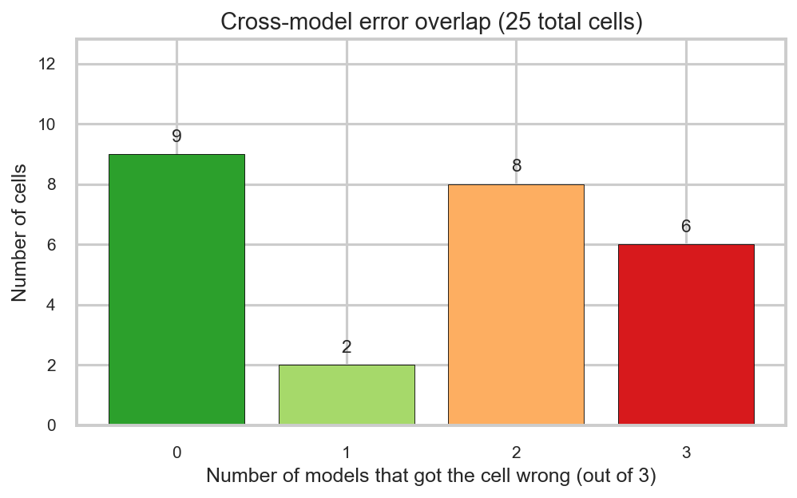

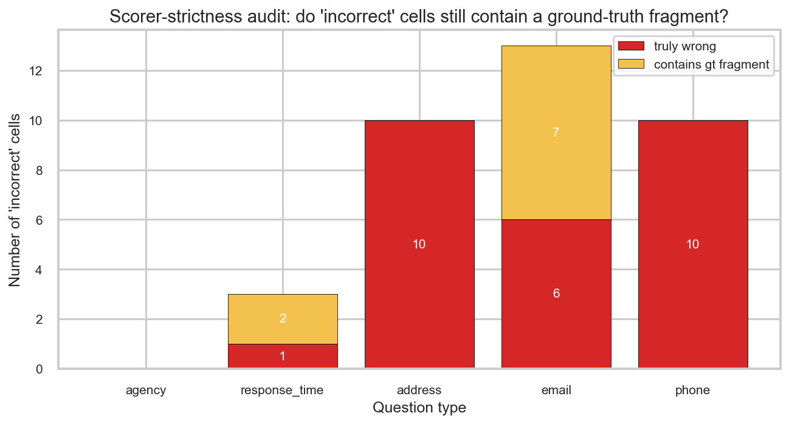

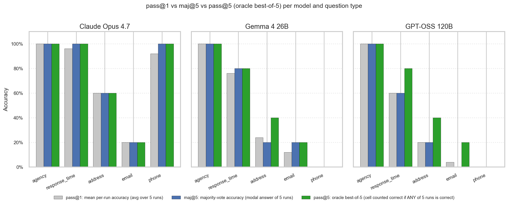

### Tables (Markdown renderings)

- [t3_01_hard_cells_all_models_wrong](tables/tier3/t3_01_hard_cells_all_models_wrong.md)
- [t3_01_models_wrong_histogram](tables/tier3/t3_01_models_wrong_histogram.md)
- [t3_02_matcher_false_negative_counts](tables/tier3/t3_02_matcher_false_negative_counts.md)
- [t3_02_matcher_false_negative_details](tables/tier3/t3_02_matcher_false_negative_details.md)
- [t3_03_pass_at_k_vs_maj](tables/tier3/t3_03_pass_at_k_vs_maj.md)

## Tier 4 - Sources & grounding

- Top domain across all models: mass.gov.
- Claude Opus 4.7 .gov ratio: correct 92% (n=19) vs incorrect 100% (n=6).
- Gemma 4 26B .gov ratio: correct 69% (n=11) vs incorrect 99% (n=14).
- GPT-OSS 120B .gov ratio: correct 98% (n=9) vs incorrect 98% (n=16).
- See t4_03 for per-model breakdown of unique URL counts per cell split by correctness.
- Claude Opus 4.7 state-specific citations: correct 18/19 (95%), incorrect 6/6 (100%).
- Gemma 4 26B state-specific citations: correct 9/11 (82%), incorrect 14/14 (100%).
- GPT-OSS 120B state-specific citations: correct 9/9 (100%), incorrect 16/16 (100%).

### Plots

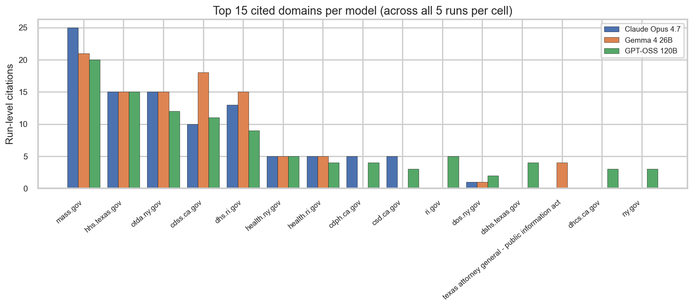

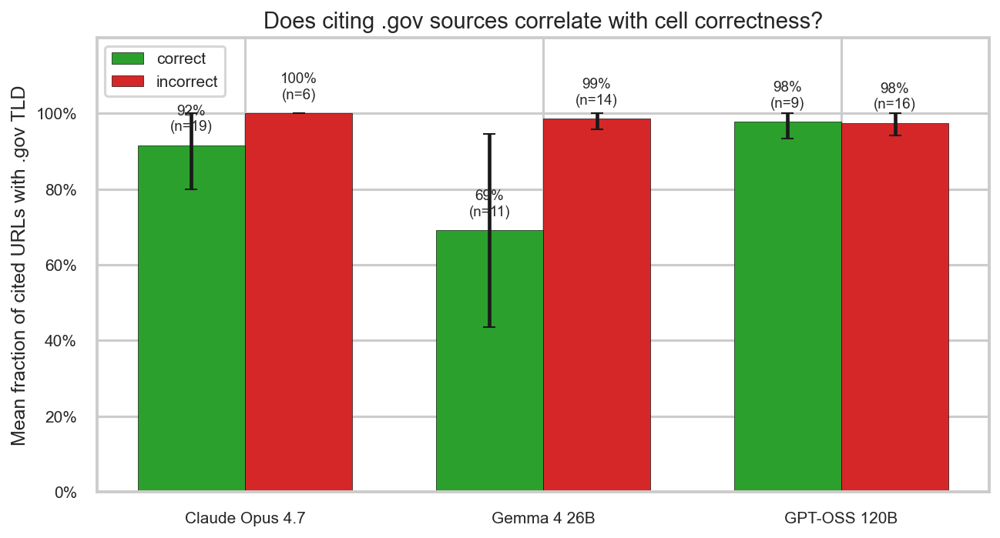

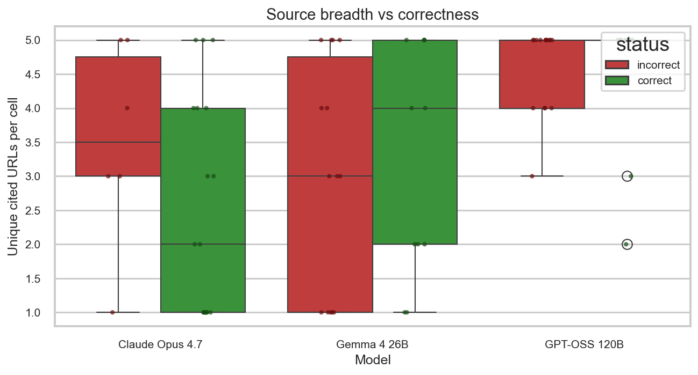

### Tables (Markdown renderings)

- [t4_01_source_domain_distribution](tables/tier4/t4_01_source_domain_distribution.md)
- [t4_02_gov_ratio_per_cell](tables/tier4/t4_02_gov_ratio_per_cell.md)
- [t4_02_gov_ratio_vs_correctness](tables/tier4/t4_02_gov_ratio_vs_correctness.md)
- [t4_03_source_count_vs_correctness](tables/tier4/t4_03_source_count_vs_correctness.md)
- [t4_04_citation_state_consistency](tables/tier4/t4_04_citation_state_consistency.md)
- [t4_04_citation_state_per_cell](tables/tier4/t4_04_citation_state_per_cell.md)

